<div align="center">

```
███████╗██╗   ██╗██╗██████╗ ███████╗███╗   ██╗ ██████╗███████╗
██╔════╝██║   ██║██║██╔══██╗██╔════╝████╗  ██║██╔════╝██╔════╝
█████╗  ██║   ██║██║██║  ██║█████╗  ██╔██╗ ██║██║     █████╗
██╔══╝  ╚██╗ ██╔╝██║██║  ██║██╔══╝  ██║╚██╗██║██║     ██╔══╝
███████╗ ╚████╔╝ ██║██████╔╝███████╗██║ ╚████║╚██████╗███████╗
╚══════╝  ╚═══╝  ╚═╝╚═════╝ ╚══════╝╚═╝  ╚═══╝ ╚═════╝╚══════╝
```

<h3>From complaint to court-ready case packet — in under 5 minutes.</h3>
<p><em>AI legal case builder · Multimodal exhibit analysis · No backend · No lawyer · No cost</em></p>

---

<a href="https://evidencelocker.vercel.app">
  
</a>
&nbsp;
<a href="https://quantumsprint.devpost.com">
  
</a>

---

<table>
<tr>
<td align="center"></td>
<td align="center"></td>
<td align="center"></td>
</tr>
<tr>
<td align="center"></td>
<td align="center"></td>
<td align="center"></td>
</tr>
<tr>
<td align="center"></td>
<td align="center"></td>
<td align="center"></td>
</tr>
</table>

</div>

---

## The Problem

> **$50,000,000,000** is stolen from American workers, tenants, and consumers every year.
> Most is never recovered — not because people lack evidence.
> Because they cannot transform that evidence into a credible case.

Victims commonly have screenshots, leases, pay stubs, invoices, and texts. What they lack is the structure to turn those files into something a judge, agency, or opposing party takes seriously.

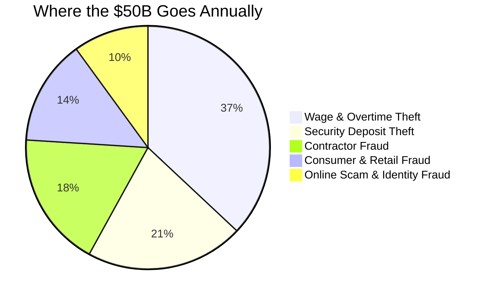

---

## The Solution

EvidenceLocker is a **litigation-preparation workflow**, not a chatbot. It moves a user from a raw complaint to a formal case packet through four structured stages:

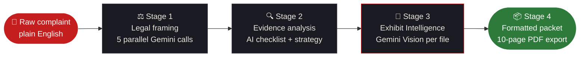

Most tools stop at Stage 2. EvidenceLocker builds Stages 3 and 4 — the ones that make a case **credible** to an opposing party.

---

## What It Produces

```
INPUT ───────────────────────────────────────────────────────────────────────
  "My landlord refused to return my $2,400 deposit. I left the apartment
   in perfect condition. He's ignored my texts for 6 weeks."

  + screenshot-texts.png       ← user uploads
  + move-out-photos.jpg        ← user uploads
  + lease-agreement.pdf        ← user uploads

STAGE 1 — BASE ANALYSIS (5 parallel Gemini calls) ──────────────────────────

  ⚖️  VIOLATIONS REPORT     6 statutes · Cal. Civ. Code § 1950.5 · URLTA § 4.104
                             Case strength 88/100 · Recovery $2,400–$7,200

  📋 EVIDENCE CHECKLIST     10 items · 3 marked [CRITICAL]
                             Exact preservation steps per item

  📄 DEMAND LETTER          Complete · Full citations · $4,800 demanded
                             14-day deadline · Ready to print today
                             Auto-upgraded to cite Exhibit A, B, C by name

  🗺️  FILING ROADMAP         California small claims · SC-100 · $75 fee
                             9 numbered steps · What to say / not say

  🎯 CASE STRATEGY          84% success probability
                             Settle first · 2× statutory penalty leverage

STAGE 2 — EXHIBIT INTELLIGENCE (Vision analysis + synthesis) ───────────────

  📑 EXHIBIT INDEX
     Exhibit A   screenshot-texts.png
                 "Proves landlord received move-out notice on March 3rd"
     Exhibit B   move-out-photos.jpg
                 "Unit condition at departure — zero damage in 14 photos"
     Exhibit C   lease-agreement.pdf
                 "Signed lease confirming deposit terms and landlord identity"

  🔗 CLAIM SUPPORT MATRIX   Exhibit A → claims 1, 3, 6
                             Exhibit B → claims 2, 4
                             Exhibit C → claims 1, 5, 6

  🕳️  PROOF GAPS              Missing: bank statement showing deposit payment
                             Missing: move-in inspection report

  ✍️  CITED LETTER ADDENDUM  "Pursuant to Exhibit A (text message, Mar 3),
                              respondent demonstrably received written notice..."
```

---

## End-to-End Architecture

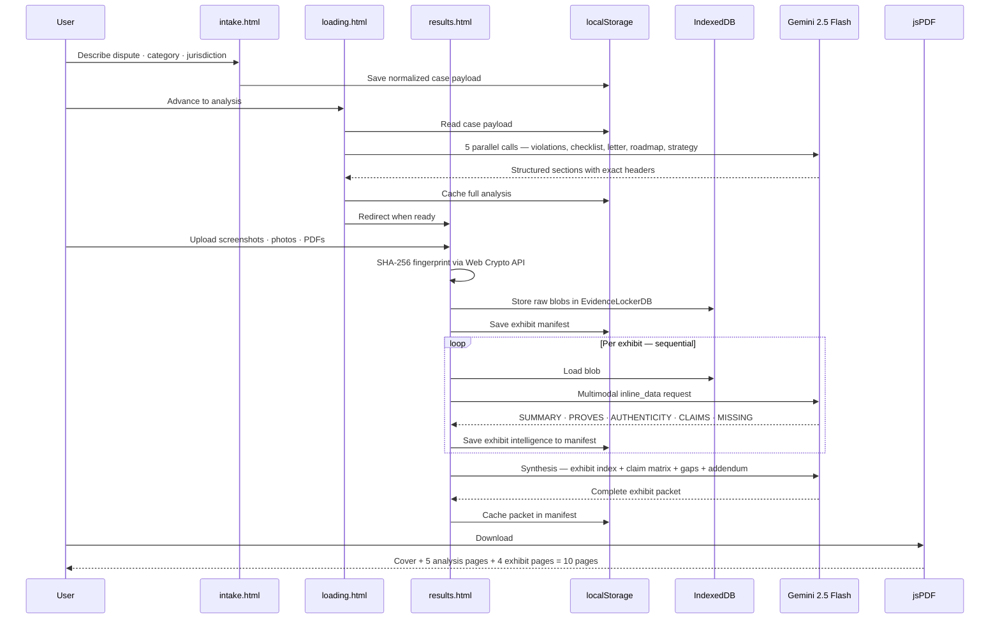

---

## System Architecture

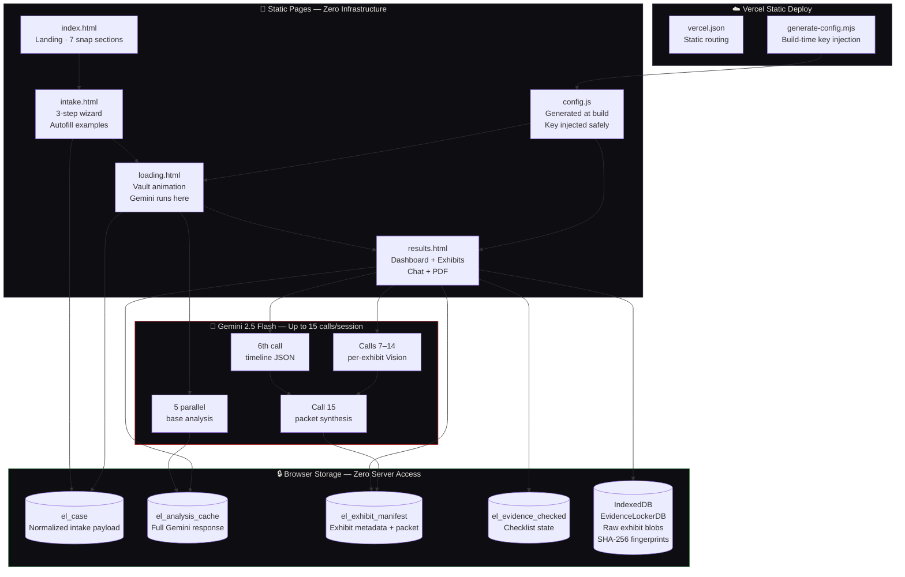

---

## Why No Backend

This is the architecture decision that makes EvidenceLocker unique. Every comparable tool routes files through a server. EvidenceLocker keeps everything in the browser:

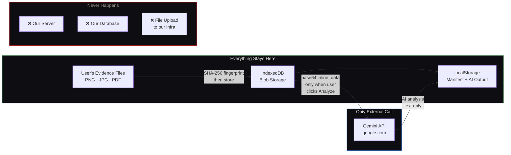

| Property | Result |
|---|---|
|  | Files never leave the user's device except to Gemini |
|  | API calls go browser → Google directly |
|  | No servers to run, pay for, or maintain |
|  | We cannot subpoena what we never stored |
|  | Vercel free tier handles unlimited traffic |

---

## Exhibit Intelligence — Deep Dive

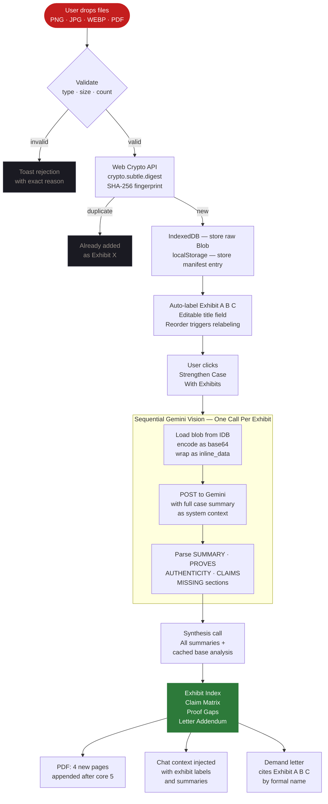

---

## Recovery Impact: Base vs Exhibit-Cited

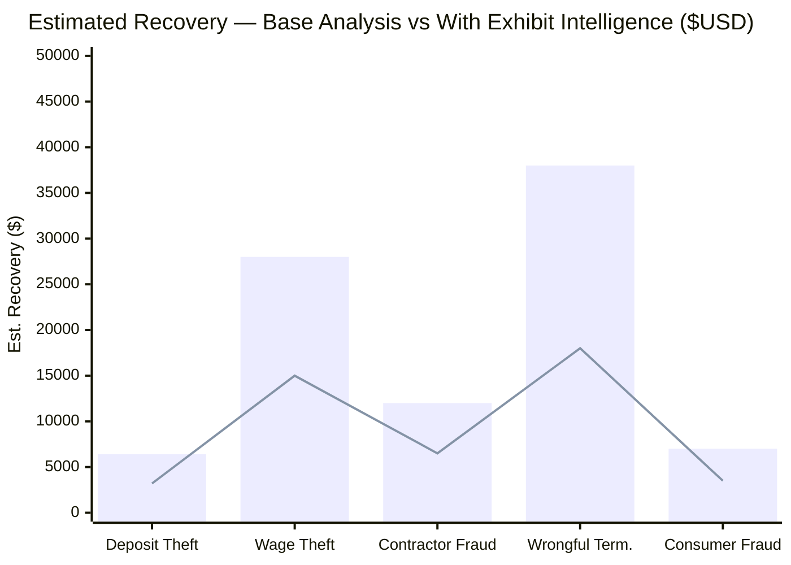

*Bar = with exhibit-cited demand letter. Line = base analysis only. Exhibits shift settlement calculus.*

---

## Competitive Position

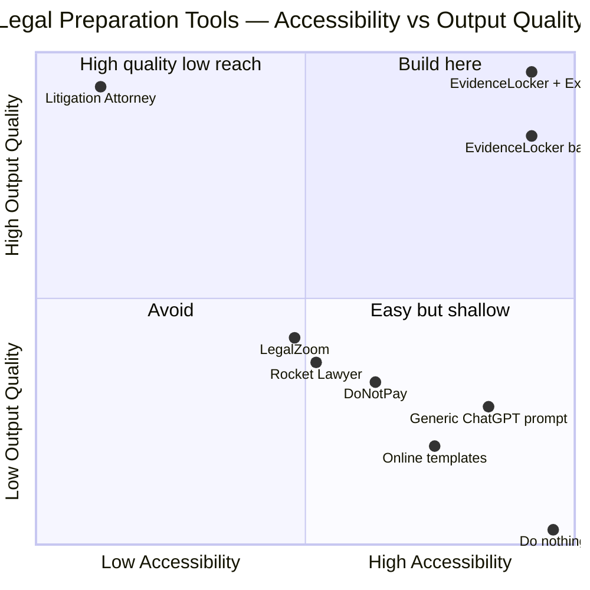

---

## PDF Export — 10 Pages

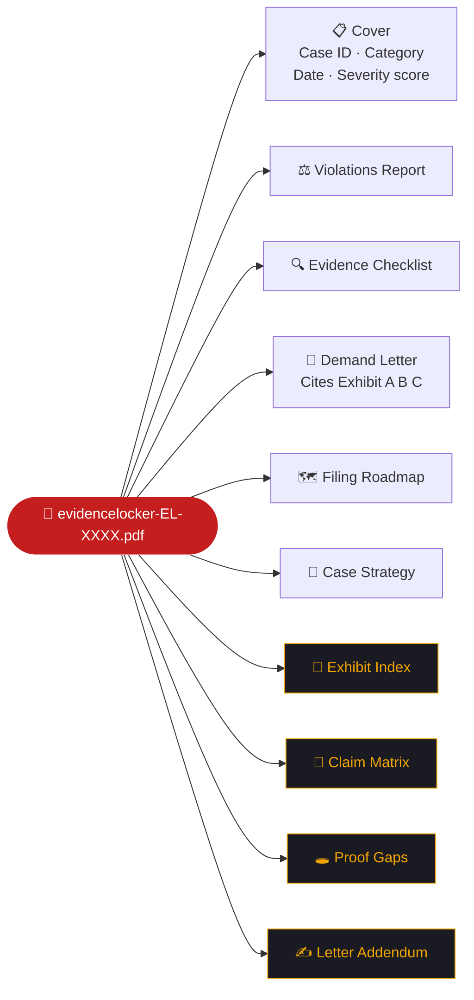

*Pages 7–10 (amber) appear only when Exhibit Intelligence has been run.*

---

## Feature Matrix

###  Five AI Documents

| | Feature | What's Inside |
|:---:|---|---|
|  | **Violations Report** | Every applicable statute by exact code. Federal + state + local. Penalty + remedy per violation. Case strength 0–100. |
|  | **Evidence Checklist** | 8–10 specific items. Exact preservation steps. 3 flagged `[CRITICAL]`. Checkboxes persisted to `localStorage`. |
|  | **Demand Letter** | Complete letter. Full statute citations. Exact amount. 14-day deadline. **Auto-upgraded to cite exhibits by formal label.** |
|  | **Filing Roadmap** | Jurisdiction-specific. NLRB / EEOC / small claims. Fees, URLs, deadlines, exact scripts. |
|  | **Case Strategy** | Success probability %. Settlement range $. Recommended path. Leverage points. Their likely defenses + how to counter. |

###  Four Packet Outputs

| | Feature | What's Inside |
|:---:|---|---|
|  | **Exhibit Index** | Formal `Exhibit A / B / C` labeling. AI summary, what it proves, authenticity notes. Editable titles. Reorder-aware relabeling. |
|  | **Claim Support Matrix** | Every case claim mapped to supporting exhibits. Coverage gaps visible at a glance. Synthesis call after all exhibits complete. |
|  | **Proof Gaps** | Missing evidence identified. Specific items listed. How to obtain each. Prioritized by claim impact. |
|  | **Cited Letter Addendum** | Attorney-grade paragraphs citing `Exhibit A`, `Exhibit B` by exact formal label. Appends to demand letter. |

###  Storage & Deploy

| | Feature | Implementation |
|:---:|---|---|
|  | Persistent exhibit files | `IndexedDB EvidenceLockerDB` — survives page reload, never leaves device |
|  | SHA-256 fingerprinting | `crypto.subtle.digest` — same file twice → `Already added as Exhibit X` |
|  | Exhibit metadata | `localStorage el_exhibit_manifest:${caseId}` — survives refresh |
|  | No-rerun architecture | `loading.html` caches Gemini response. `results.html` reads cache — no re-runs on reload |
|  | Build-time injection | `generate-config.mjs` → `config.js` → `window.__EVIDENCELOCKER_CONFIG__` — no key committed |
|  | Graceful degradation | If IndexedDB unavailable → in-memory session storage + toast warning |

---

## Quantum Sprint Rubric Alignment

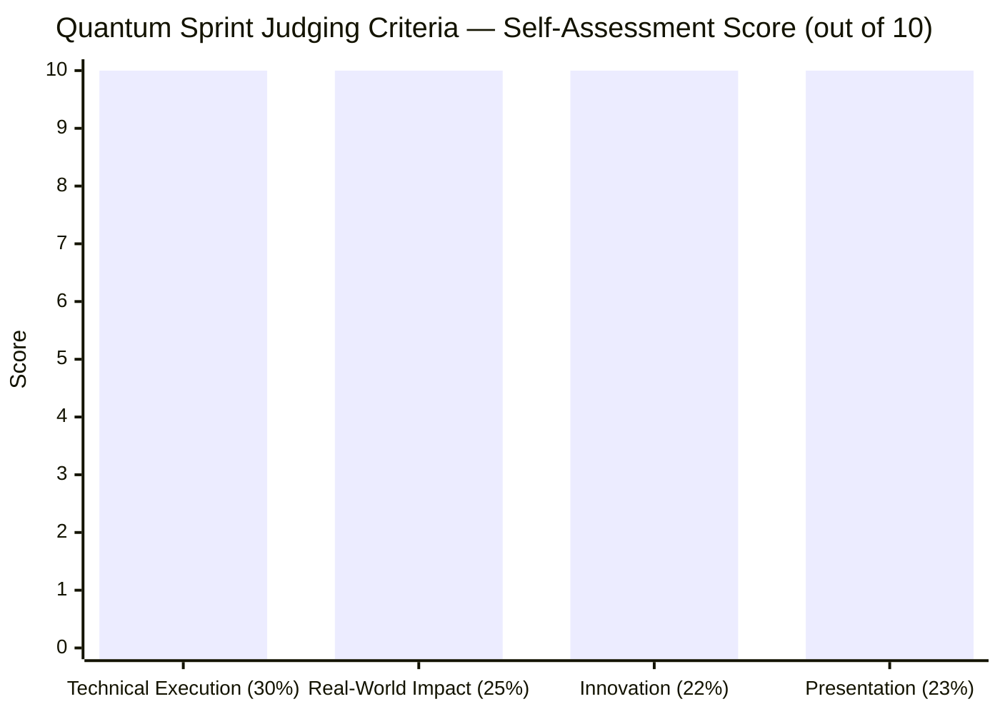

<details>
<summary><strong>⚙️ Technical Execution (30%)</strong></summary>

- Static multi-page architecture with no backend dependency
- `generate-config.mjs` build script for safe Vercel key injection via `window.__EVIDENCELOCKER_CONFIG__`
- Analysis pipeline cached in `loading.html` and consumed in `results.html` — zero re-runs on reload
- Structured section parsing with fallback recovery when model omits headers
- `Promise.allSettled()` firing 5 Gemini calls simultaneously on page load
- IndexedDB open/upgrade/transaction pattern for exhibit blob storage
- `crypto.subtle.digest('SHA-256')` fingerprinting — no library needed
- Gemini `inline_data` multimodal calls — images and PDFs encoded as base64
- Sequential per-exhibit analysis with live per-row status: `Stored → Analyzing → Analyzed`
- Synthesis call combining all exhibit summaries + cached base analysis
- Manifest versioning — reorder/remove invalidates packet, forces regeneration
- jsPDF extended with 4 dark-themed exhibit pages, consistent footer on every page
- Chat system prompt injection with exhibit labels, summaries, and proof gaps
- IDB graceful degradation to in-memory with user-visible toast
- SVG `stroke-dashoffset` severity ring with `easeOutCubic` easing over 1200ms
- 4-page wizard with `translateX` transitions at `cubic-bezier(0.4,0,0.2,1)`
- JS lerp cursor running at 60fps via `requestAnimationFrame`

</details>

<details>
<summary><strong>🌍 Real-World Impact & Feasibility (25%)</strong></summary>

- Targets highest-volume disputes: deposits, wages, contractors, consumer fraud
- Works without accounts, lawyers, servers, or any support infrastructure
- Deploys as 4 static files on Vercel — free tier handles all traffic at any scale
- One env var (`GEMINI_API_KEY`) is the entire operations surface area
- Commercially viable path: free tier → premium packet review → attorney escalation → white-label for nonprofits
- Exhibit Intelligence changes settlement calculus — exhibit-cited letters are taken seriously in a way generic letters are not
- Practical for: direct consumers, legal aid clinics, housing justice orgs, labor advocates, tenant rights groups

</details>

<details>
<summary><strong>💡 Innovation & Originality (22%)</strong></summary>

- Gemini used three distinct ways: legal framing, multimodal file review, packet synthesis
- No other client-only tool combines blob storage + SHA-256 dedup + Vision API + PDF synthesis without a backend
- The exhibit pipeline treats uploaded files as first-class legal artifacts — not attachments
- `loading.html` runs Gemini and caches — `results.html` renders from cache, not re-runs
- Design language: brutalist dark type, single red accent, vault padlock animation, lerp cursor — nothing in legal tech looks like this
- The demo moment: drop a screenshot → it becomes `Exhibit A` with claim links → demand letter cites it by name

</details>

<details>
<summary><strong>🎨 Presentation & Product Clarity (23%)</strong></summary>

- Clear page-to-page journey with no dead ends or confusing states
- 10-page PDF creates a tangible printable artifact a user can bring to a hearing
- Chat assistant references exhibits: "Based on Exhibit A, you can argue..."
- Every Gemini call is visible to the user: streaming text, status pills, progress bar
- Per-exhibit `Failed` state with individual retry — no full-page crashes
- Professional autofill examples guide users to the right level of input detail

</details>

---

## User Journey

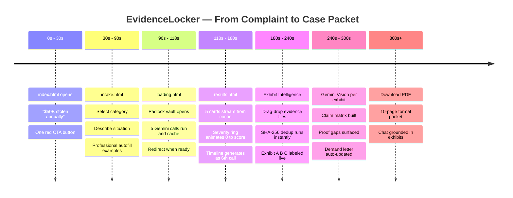

---

## Who It's For

| Person | What Happened | EvidenceLocker Produces |
|---|---|---|
|  | Landlord withheld $2,400 deposit | Exhibit A (texts) + B (photos) cited · § 1950.5 · 2× penalty · small claims roadmap |
|  | 6 months unpaid overtime | Exhibit A (pay stubs) + B (schedule) · FLSA § 207 · NLRB filing · liquidated damages |
|  | Contractor took $7K, disappeared | Exhibit A (contract) + B (receipt) · breach analysis · license board complaint |
|  | Defective item, refund refused | Exhibit A (product photos) + B (receipt) · FTC complaint · chargeback guide |
|  | Fired after safety report | Exhibit A (HR email) + B (termination) · OSHA § 11(c) · EEOC charge |

---

## Repository Structure

```
evidencelocker/
├── public/
│   ├── index.html          ← Landing — 7 scroll-snap sections · brutalist design
│   ├── intake.html         ← 3-step wizard · autofill examples · localStorage save
│   ├── loading.html        ← Gemini runs here · analysis cached before redirect
│   ├── results.html        ← Dashboard · Exhibit Intelligence · Chat · PDF export
│   ├── favicon.png
│   └── config.js           ← Generated at build time — never committed to git
│
├── scripts/
│   └── generate-config.mjs ← Reads GEMINI_API_KEY · writes window.__EVIDENCELOCKER_CONFIG__
│
├── vercel.json             ← Static routing
├── .gitignore              ← config.js excluded
└── README.md
```

---

## Setup

**Vercel deploy:**

```bash
# Set in Vercel dashboard → Environment Variables:
GEMINI_API_KEY = your_key_here

# Vercel build command runs automatically:
node scripts/generate-config.mjs
# Generates public/config.js
# App reads: window.__EVIDENCELOCKER_CONFIG__.apiKey
```

**Local:**

```powershell
$env:GEMINI_API_KEY="your_key_here"
node scripts/generate-config.mjs
# Open public/index.html
```

**Free Gemini API key:** [aistudio.google.com](https://aistudio.google.com) — no credit card required.

---

## Roadmap

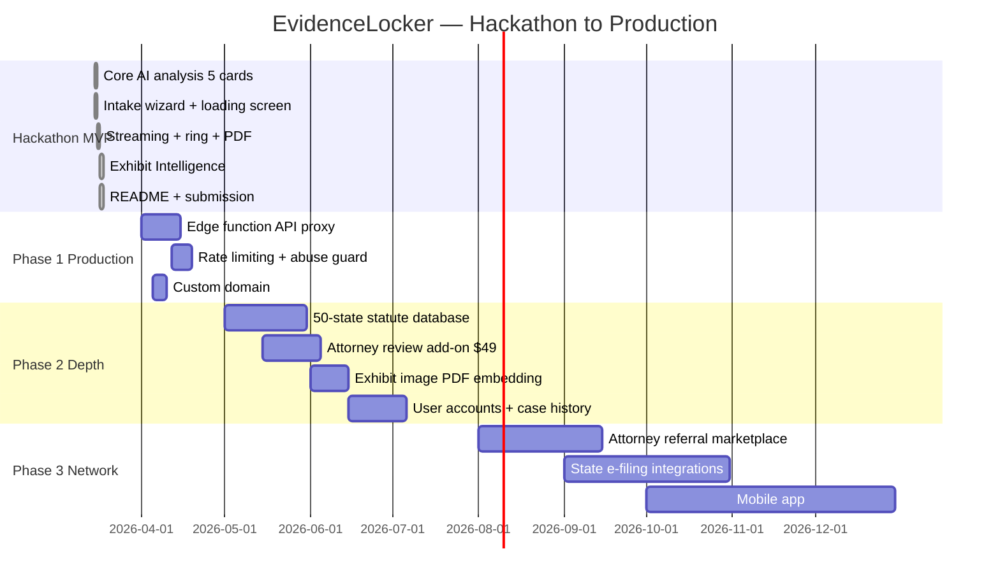

---

## License

MIT — use it, fork it, deploy it for your community.

Legal aid organizations, tenant rights groups, worker advocacy nonprofits: deploy this for the people you serve. No permission needed.

---

<div align="center">

---

```
Millions of people have evidence.
Almost none of them have a case packet.

EvidenceLocker closes that gap.
```

**Plain language → formal exhibits → cited demand → 10-page PDF**

**Free · No account · No lawyer · No backend · Under 5 minutes**

---

<a href="https://evidencelocker.vercel.app">
  
</a>

*Built with precision and anger.*

</div>
