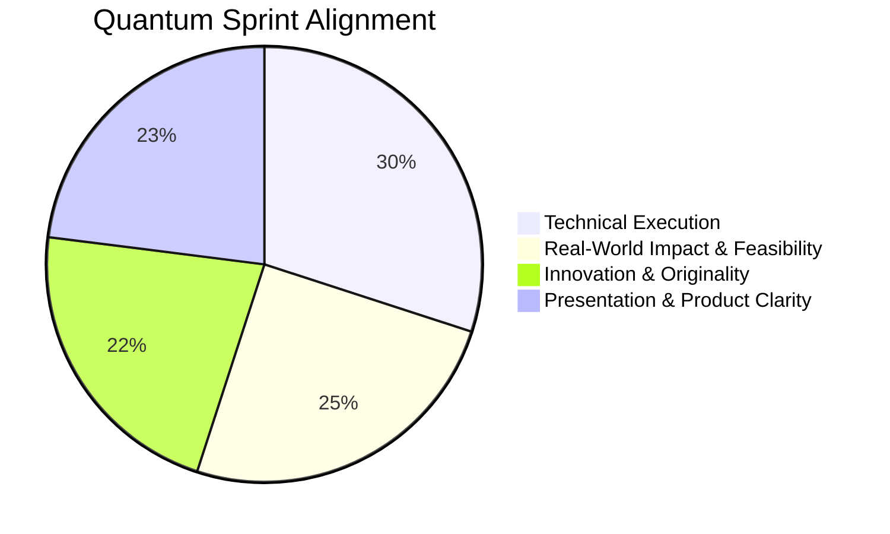
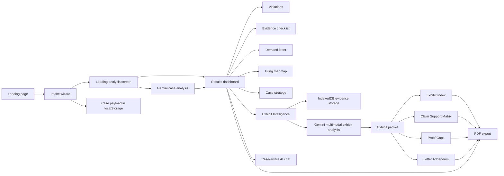
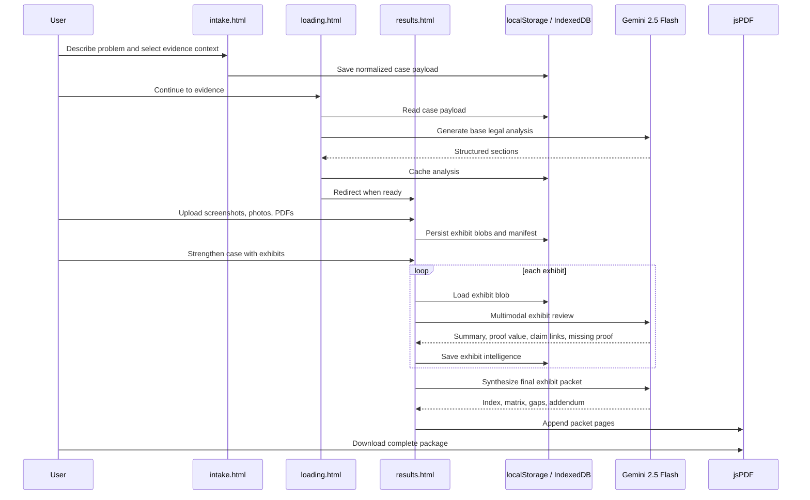

# EvidenceLocker

**AI-powered case building for people dealing with landlord abuse, wage theft, contractor fraud, scams, and consumer disputes.**

Built for **[Quantum Sprint](https://quantumsprint.devpost.com/)**.


[Live Demo](https://evidencelocker.vercel.app)

---

## Overview

EvidenceLocker is a client-side legal-preparation system that turns a plain-English complaint into a structured, judge-facing case packet.

The product is built for people who know they were wronged but do not know:

- what laws may apply
- what evidence matters
- what to demand
- where to file
- how to organize proof into something credible

Instead of acting like a generic chatbot, EvidenceLocker behaves like a focused case-building workflow:

1. capture facts
2. analyze legal posture
3. identify evidence
4. convert uploads into formal exhibits
5. produce a packet the user can send, print, or bring to a hearing

That is the core idea: move from "AI gives advice" to "AI helps assemble a real case."

---

## Problem

Millions of people face disputes that are too small for a lawyer to economically handle, but too serious to ignore:

- security deposits withheld without justification
- unpaid overtime and wage theft
- contractors taking deposits and disappearing
- retaliatory firing after complaints
- consumer fraud and refund refusals

The gap is not always the absence of facts. The gap is the absence of structure.

Victims often have screenshots, receipts, leases, invoices, or emails, but they do not know how to transform those into:

- a coherent legal theory
- a persuasive demand
- a filing roadmap
- a credible exhibit packet

EvidenceLocker closes that gap in one browser-based flow.

---

## What the Product Does

EvidenceLocker currently generates:

- likely statutory violations and legal claims
- an evidence checklist with preservation guidance
- a demand letter
- a filing roadmap
- a compact case strategy
- follow-up AI chat grounded in the case
- a multimodal exhibit appendix built from uploaded screenshots, photos, and PDFs

The standout capability is **Exhibit Intelligence**:

- users upload real evidence files
- files are stored locally in the browser
- Gemini analyzes each file multimodally
- the app labels them `Exhibit A`, `Exhibit B`, `Exhibit C`, and so on
- the app generates a judge-facing packet:
  - Exhibit Index
  - Claim Support Matrix
  - Proof Gaps
  - Cited Letter Addendum

This turns the project from a legal explainer into a litigation-prep tool.

---

## Why This Fits Quantum Sprint

Quantum Sprint judges on:

- Technical Execution
- Real-World Impact & Feasibility
- Innovation & Originality
- Presentation & Product Clarity

EvidenceLocker is built directly against those criteria.

### Rubric Alignment



### Technical Execution

- static multi-page architecture with no backend dependency
- structured parsing and section recovery for model output
- cached analysis pipeline between intake, loading, and results
- IndexedDB blob storage plus local manifest management
- multimodal Gemini requests for images and PDFs
- packet synthesis that cross-references exhibits and claims
- PDF export that appends exhibit intelligence cleanly

### Real-World Impact & Feasibility

- targets common legal-adjacent disputes with large user volume
- works without accounts, lawyers, or a support team
- deploys as a static app on Vercel
- uses one configurable Gemini key and browser storage only
- can be used today by tenants, workers, and consumers

### Innovation & Originality

- not just "ask AI a legal question"
- combines case analysis, evidence handling, packet generation, and exhibit reasoning in one flow
- bridges plain-language intake and formal exhibit structure
- emphasizes adversarial preparation, not generic productivity

### Presentation & Product Clarity

- clear page-to-page journey
- high-contrast visual identity
- cinematic loading state
- judge-friendly outputs and export flow
- demo moments that visibly escalate from complaint to formal packet

---

## End-to-End Flow



---

## System Architecture



---

## Product Experience

### 1. Intake

The user selects a dispute category and can use professional autofill examples to understand the expected level of detail. The form captures:

- what happened
- when it started
- jurisdiction
- estimated damages
- known evidence

### 2. Analysis Screen

Instead of making users wait on a blank page, the loading experience creates perceived progress while Gemini runs. The app only advances to the results screen once the analysis is actually ready.

### 3. Results Dashboard

The user receives a structured package with legal framing, evidence priorities, and a ready-to-use demand letter.

### 4. Exhibit Intelligence

The user uploads real files and watches them become organized exhibits with claim links and proof analysis.

### 5. Export

The packet can be downloaded as a PDF, including both the original legal analysis and the exhibit appendix.

---

## Current Features

| Area | Capability |
|---|---|
| Intake | Guided 3-step wizard with professional example autofill |
| Jurisdiction context | Captures territory, approximate start date, and damages |
| Loading UX | Animated reasoning screen that waits for real analysis completion |
| Case analysis | Violations, evidence checklist, demand letter, roadmap, strategy, actions, and timeline |
| Exhibit Intelligence | Upload images and PDFs, auto-label exhibits, analyze files multimodally |
| Persistence | `localStorage` for case state and cached analysis, `IndexedDB` for raw exhibit blobs |
| AI chat | Chat grounded in the generated case plus exhibit intelligence |
| PDF export | Core packet plus Exhibit Index, Claim Support Matrix, Proof Gaps, and Letter Addendum |
| Deployment | Static Vercel deployment with build-time API key injection |

---

## Technical Depth

This project looks simple from the outside, but the technical work is in the orchestration:

- prompt design that forces structured section output
- fallback logic when the model omits required sections
- state handoff across multiple static HTML pages
- cached loading-to-results analysis flow
- client-side evidence storage without a backend
- multimodal file processing with a single Gemini integration pattern
- exhibit packet synthesis on top of prior analysis
- chat augmentation with evidence-aware context
- Vercel-safe environment injection without committing a real API key

This is intentionally engineered as a lightweight system with disproportionate output quality.

---

## Real-World Adoption Path

EvidenceLocker is practical because it avoids operational complexity:

- no accounts
- no server maintenance
- no internal case database
- no paid infrastructure requirement
- no dependency on legal office workflows

That makes it viable for:

- direct consumer use
- legal aid clinics
- nonprofit intake support
- housing justice and worker rights organizations
- pilot deployments on static hosting

The commercialization path is also credible:

- free self-serve case generation
- premium guided packet review
- paid expert escalation
- white-labeled versions for advocacy organizations

---

## What Makes It Original

Many AI legal demos stop at:

- summarizing facts
- citing laws
- producing a generic letter

EvidenceLocker goes further by treating evidence organization as a first-class product feature.

The novel part is not just that Gemini is used. It is how the system uses Gemini:

- once for legal framing
- again for multimodal exhibit review
- again for packet synthesis

All of that is then anchored into a coherent browser-native workflow that feels like preparing a real case file, not chatting with a bot.

---

## Demo Strategy

For a live demo, the strongest path is:

1. Start with a plain-English dispute.
2. Complete intake in under a minute.
3. Let the loading screen transition into a full legal dashboard.
4. Upload screenshots and a PDF lease or invoice.
5. Trigger Exhibit Intelligence.
6. Show the claim matrix and proof gaps.
7. Export the final packet.

That progression clearly communicates both product clarity and technical depth.

---

## Example Use Cases

- A tenant whose landlord ignored repair requests and withheld rent credits.
- A worker tracking months of unpaid overtime.
- A customer whose refund was denied despite documentation.
- A homeowner dealing with a partial contractor scam.
- A whistleblower facing retaliation after reporting a workplace issue.

These are exactly the kinds of cases where the claimant often has evidence, but lacks organization and confidence.

---

## Deployment

This repository is configured for Vercel.

### Required environment variable

- `GEMINI_API_KEY`

### Build behavior

Vercel runs:

```bash
node scripts/generate-config.mjs
```

That generates:

```text
public/config.js
```

The app reads the key from `window.__EVIDENCELOCKER_CONFIG__`, so no real API key is committed to source control.

---

## Local Run

PowerShell:

```powershell
$env:GEMINI_API_KEY="YOUR_GEMINI_API_KEY"
node scripts/generate-config.mjs
```

Then open:

```text
public/index.html
```

---

## Repository Structure

```text
Evidencelocker/
|-- public/
|   |-- index.html
|   |-- intake.html
|   |-- loading.html
|   |-- results.html
|   |-- favicon.png
|   `-- config.js
|-- scripts/
|   `-- generate-config.mjs
|-- .gitignore
|-- README.md
`-- vercel.json
```

---

## Core Files

| File | Purpose |
|---|---|
| [public/index.html](public/index.html) | landing page and product positioning |
| [public/intake.html](public/intake.html) | dispute intake, examples, and data capture |
| [public/loading.html](public/loading.html) | timed analysis screen and cached model execution |
| [public/results.html](public/results.html) | legal dashboard, Exhibit Intelligence, chat, and export |
| [scripts/generate-config.mjs](scripts/generate-config.mjs) | build-time config injection for Vercel |
| [vercel.json](vercel.json) | static deployment configuration |

---

## Why This Project Matters

EvidenceLocker is not trying to replace lawyers.

It is trying to solve a more immediate problem: most people never reach the point where a lawyer, judge, clinic, or agency sees their case in a usable form.

This project gives ordinary people a way to cross that gap:

- from emotion to structure
- from screenshots to exhibits
- from "something bad happened" to "here is the case file"

That is a meaningful product outcome, and it is why this project is strong for Quantum Sprint.

---

## License

MIT
