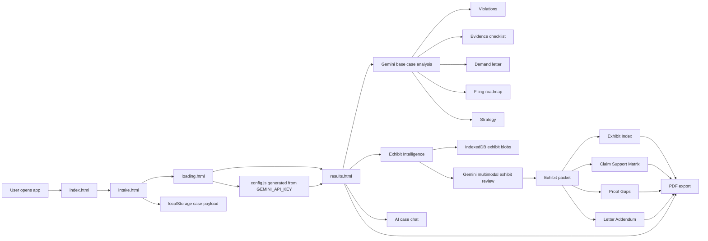
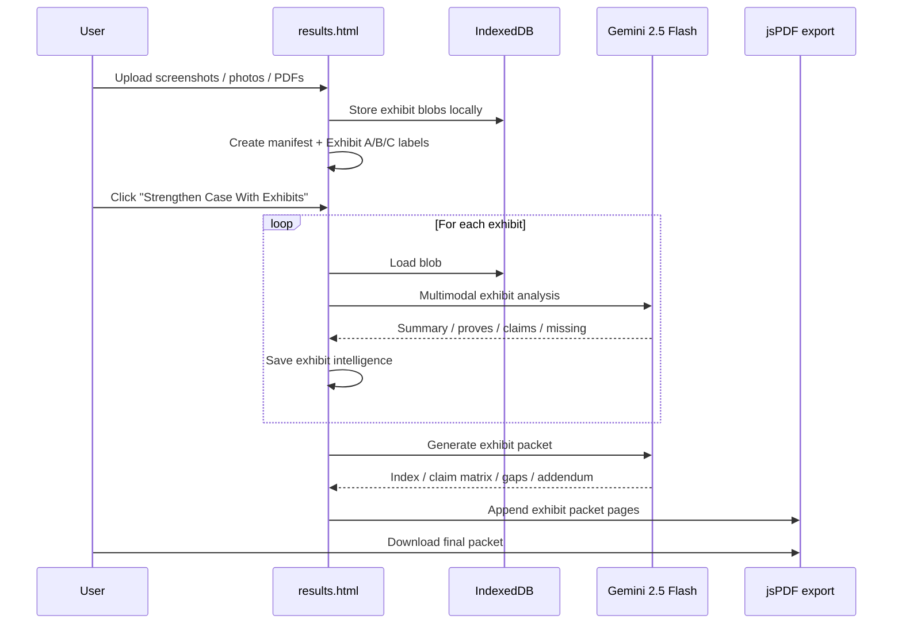

<div align="center">

# EvidenceLocker

### Build your case. Get what you're owed.

AI-powered legal case building for people dealing with landlord abuse, wage theft, contractor fraud, scams, and consumer disputes.


[Live Demo](https://evidencelocker.vercel.app)

</div>

---

## What this is

EvidenceLocker turns a plain-English complaint into a structured legal case package:

- violations and statutes that likely apply
- evidence checklist with preservation guidance
- demand letter
- filing roadmap
- strategy and recovery framing
- AI chat grounded in the actual case
- multimodal exhibit packet built from uploaded screenshots, photos, and PDFs

The core value is not "AI text generation." The core value is turning messy facts into something that looks organized, strategic, and court-aware.

---

## What makes it different now

The project has moved beyond a basic intake-to-results demo.

### New high-impact functionality

- **Exhibit Intelligence**
  Upload real screenshots, photos, and PDFs directly on the results page.
- **Multimodal evidence review**
  The same Gemini API key now powers both legal analysis and evidence inspection.
- **Formal exhibit labeling**
  Files are relabeled as `Exhibit A`, `Exhibit B`, `Exhibit C`, and so on.
- **Judge-facing packet generation**
  The app now produces:
  - Exhibit Index
  - Claim Support Matrix
  - Proof Gaps
  - Cited Letter Addendum
- **Browser-persistent evidence storage**
  Exhibits are stored in IndexedDB with local metadata manifests.
- **Exhibit-aware chat**
  The AI assistant now answers using case analysis plus exhibit summaries and proof gaps.
- **Expanded PDF export**
  The downloaded packet appends exhibit packet sections after the original 5 analysis sections.
- **Vercel-ready env flow**
  The committed Gemini key is removed. `public/config.js` is generated from `GEMINI_API_KEY` at deploy time.

---

## Judge-demo moments

If this is being judged live, these are the strongest moments:

1. User completes the intake in plain language.
2. The loading screen performs a cinematic "analysis engine" transition.
3. Results appear as a full case strategy dashboard.
4. User drags in real screenshots or a lease PDF.
5. The app labels them as formal exhibits and explains what each one proves.
6. The app generates a cited exhibit packet and appends it to the downloadable PDF.

That shift matters. It moves the project from "smart legal explainer" to "AI case packet builder."

---

## GitHub-rendered architecture

### End-to-end product flow



### Exhibit Intelligence runtime



---

## Feature set

| Area | What ships now |
|---|---|
| Intake | 3-step wizard with category selection, professional example autofill, live preview, and evidence selection |
| Loading | Timed analysis screen with animated reasoning visuals and staged transition into results |
| Case analysis | Combined Gemini output for violations, evidence, letter, roadmap, strategy, actions, and timeline |
| Exhibit Intelligence | Upload images and PDFs, label exhibits, store them locally, analyze them multimodally, build exhibit packet |
| Persistence | `localStorage` for case data and analysis caches, `IndexedDB` for raw exhibit blobs |
| AI chat | Case-aware assistant grounded in generated legal analysis plus exhibit intelligence |
| PDF export | Core 5-section packet plus exhibit appendix pages |
| Deployment | Static Vercel deployment with build-time `config.js` generation from environment variables |

---

## Why it scores well

### Product depth

This is not one prompt pasted into a textarea. The app now has:

- intake orchestration
- staged loading UX
- structured parsing
- retry logic for malformed model output
- local persistence
- multimodal exhibit review
- packet synthesis
- export
- follow-up chat

### Technical ambition

The strongest technical jump is the evidence system:

- drag-and-drop upload
- fingerprinting
- local blob persistence
- multimodal Gemini requests for images and PDFs
- packet synthesis across exhibits and prior legal analysis
- packet-aware chat and PDF appendices

### Design clarity

The project has a strong point of view. It does not look like a generic productivity dashboard. The UI feels adversarial, procedural, and intentional, which matches the domain.

---

## Current pages

| File | Role |
|---|---|
| [public/index.html](public/index.html) | Landing page |
| [public/intake.html](public/intake.html) | 3-step intake wizard |
| [public/loading.html](public/loading.html) | Analysis/loading transition |
| [public/results.html](public/results.html) | Case dashboard, Exhibit Intelligence, chat, export |
| [public/config.js](public/config.js) | Build-generated browser config with Gemini key placeholder or injected env value |

---

## Storage model

### localStorage

Used for:

- case intake payload
- base analysis cache
- exhibit manifest metadata
- evidence checklist completion state

### IndexedDB

Used for:

- raw uploaded exhibit blobs

Database details:

- DB name: `EvidenceLockerDB`
- Store name: `exhibits`

This keeps the app client-only while still supporting real evidence persistence across reloads.

---

## Deployment on Vercel

This repo is configured for Vercel static deployment with a build-time environment injection step.

### Required environment variable

- `GEMINI_API_KEY`

### How it works

1. Vercel runs:

```bash
node scripts/generate-config.mjs
```

2. That script writes:

```text
public/config.js
```

3. `loading.html` and `results.html` read `window.__EVIDENCELOCKER_CONFIG__.GEMINI_API_KEY`.

No real API key is committed to the repo.

### Vercel config

The app uses:

- build command: `node scripts/generate-config.mjs`
- output directory: `public`

---

## Local setup

### Quick local run

PowerShell:

```powershell
$env:GEMINI_API_KEY="YOUR_GEMINI_API_KEY"
node scripts/generate-config.mjs
```

Then open:

```text
public/index.html
```

### Notes

- No backend
- No database server
- No npm install required
- One small build-time script only

---

## Example demo prompts

Use these when demoing:

```text
My landlord refused to return my $2,400 security deposit after move-out and stopped answering my texts.

My employer has been making me work overtime for months without paying the overtime rate.

A contractor took a $7,000 deposit, did partial work, and disappeared.

I was fired two days after I reported a safety issue to HR.

An online seller sent a defective item and refuses to refund me.
```

Then upload:

- screenshots of texts
- payment records
- lease or invoice PDFs
- damaged property photos

That creates the strongest Exhibit Intelligence demo.

---

## Repo structure

```text
evidencelocker/
├── public/
│   ├── index.html
│   ├── intake.html
│   ├── loading.html
│   ├── results.html
│   ├── favicon.png
│   └── config.js
├── scripts/
│   └── generate-config.mjs
├── .env
├── README.md
└── vercel.json
```

---

## What this project is really proving

EvidenceLocker is a bet that legal leverage can be productized for people who normally cannot afford it.

The most important thing in the repo is not the model call. It is the system around the model:

- getting structured facts in
- translating them into legal framing
- tying claims to evidence
- surfacing missing proof
- producing something the user can actually send, file, or bring

That is why the exhibit packet matters so much. It turns "interesting AI" into "usable legal preparation."

---

## Built with

- Vanilla HTML
- Vanilla CSS
- Vanilla JavaScript
- Gemini 2.5 Flash
- jsPDF
- localStorage
- IndexedDB
- Vercel static deployment

---

## License

MIT

If you are a legal aid org, clinic, or public-interest builder, fork it and push it further.
