<div align="center">

```
███████╗██╗   ██╗██╗██████╗ ███████╗███╗   ██╗ ██████╗███████╗
██╔════╝██║   ██║██║██╔══██╗██╔════╝████╗  ██║██╔════╝██╔════╝
█████╗  ██║   ██║██║██║  ██║█████╗  ██╔██╗ ██║██║     █████╗
██╔══╝  ╚██╗ ██╔╝██║██║  ██║██╔══╝  ██║╚██╗██║██║     ██╔══╝
███████╗ ╚████╔╝ ██║██████╔╝███████╗██║ ╚████║╚██████╗███████╗
╚══════╝  ╚═══╝  ╚═╝╚═════╝ ╚══════╝╚═╝  ╚═══╝ ╚═════╝╚══════╝
```

<h2>Production-ready AI legal system — from complaint to court-ready case packet in under 5 minutes.</h2>

<br/>

<a href="https://evidencelocker.vercel.app">
  
</a>
&nbsp;
<a href="https://www.youtube.com/watch?v=Dr4yYFryo4g">
  
</a>
&nbsp;
<a href="https://quantumsprint.devpost.com/">
  
</a>

<br/><br/>

<table>
<tr>
<td align="center"></td>
<td align="center"></td>
<td align="center"></td>
</tr>
<tr>
<td align="center"></td>
<td align="center"></td>
<td align="center"></td>
</tr>
<tr>
<td align="center"></td>
<td align="center"></td>
<td align="center"></td>
</tr>
</table>

</div>

---

## <svg xmlns="http://www.w3.org/2000/svg" width="20" height="20" viewBox="0 0 24 24" fill="none" stroke="#C41E1E" stroke-width="2" stroke-linecap="round" stroke-linejoin="round" style="vertical-align:middle;margin-right:8px"><circle cx="12" cy="12" r="10"/><line x1="12" y1="8" x2="12" y2="12"/><line x1="12" y1="16" x2="12.01" y2="16"/></svg> Market Problem

> **$50,000,000,000** is stolen from American workers, tenants, and consumers every year.
> Most is never recovered — not because victims lack evidence, but because they cannot transform raw evidence into a credible legal case.

This is a **workflow problem**, not an information problem. Victims have the screenshots, leases, and pay stubs. What they lack is the structure to turn those files into something a court, agency, or opposing party takes seriously. The legal system was designed for people with attorneys. Everyone else loses by default.

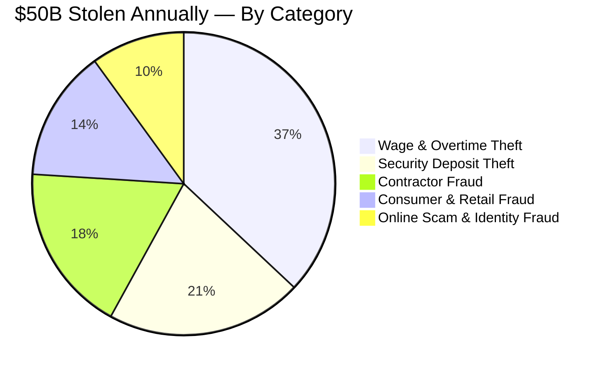

**Target market:** 40M+ Americans facing deposit fraud, wage theft, and contractor disputes annually. Underserved by every existing legal tool. Ready to pay for something that actually works.

---

## <svg xmlns="http://www.w3.org/2000/svg" width="20" height="20" viewBox="0 0 24 24" fill="none" stroke="#C41E1E" stroke-width="2" stroke-linecap="round" stroke-linejoin="round" style="vertical-align:middle;margin-right:8px"><path d="M12 22s8-4 8-10V5l-8-3-8 3v7c0 6 8 10 8 10z"/></svg> Product

EvidenceLocker is a **production-ready AI litigation-preparation system**. It moves a user from a plain-language dispute description to a formal, court-ready case packet through four structured stages.

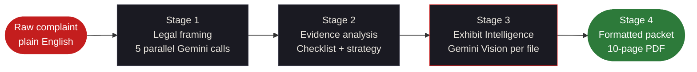

> Most tools stop at Stage 2. EvidenceLocker builds Stages 3 and 4 — the ones that make a case **credible** to an opposing party. That is the product differentiation.

---

## <svg xmlns="http://www.w3.org/2000/svg" width="20" height="20" viewBox="0 0 24 24" fill="none" stroke="#C41E1E" stroke-width="2" stroke-linecap="round" stroke-linejoin="round" style="vertical-align:middle;margin-right:8px"><line x1="12" y1="1" x2="12" y2="23"/><path d="M17 5H9.5a3.5 3.5 0 0 0 0 7h5a3.5 3.5 0 0 1 0 7H6"/></svg> Business Model

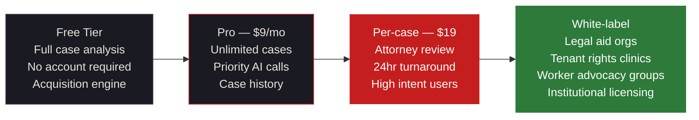

| Metric | Value |
|---|---|
| **TAM** | 40M+ Americans in active legal disputes annually |
| **Infrastructure cost** | Effectively $0 — pure static hosting, zero servers |
| **Gross margin ceiling** | ~95% at scale — API costs only |
| **Time to first value** | Under 5 minutes, no onboarding friction |
| **Viral loop** | Demand letters cite EvidenceLocker — opposing parties Google it |

---

## <svg xmlns="http://www.w3.org/2000/svg" width="20" height="20" viewBox="0 0 24 24" fill="none" stroke="#C41E1E" stroke-width="2" stroke-linecap="round" stroke-linejoin="round" style="vertical-align:middle;margin-right:8px"><path d="M14 2H6a2 2 0 0 0-2 2v16a2 2 0 0 0 2 2h12a2 2 0 0 0 2-2V8z"/><polyline points="14 2 14 8 20 8"/></svg> What It Produces

```
INPUT ──────────────────────────────────────────────────────────────────
  "My landlord refused to return my $2,400 deposit. Left in perfect
   condition. He has ignored my texts for 6 weeks."

  + screenshot-texts.png   + move-out-photos.jpg   + lease-agreement.pdf

STAGE 1 — 5 PARALLEL GEMINI CALLS ─────────────────────────────────────

  VIOLATIONS REPORT     6 statutes · Cal. Civ. Code § 1950.5 · URLTA § 4.104
                        Case strength 88/100 · Recovery est. $2,400–$7,200

  EVIDENCE CHECKLIST    10 items · 3 marked [CRITICAL] · Exact steps per item

  DEMAND LETTER         Complete · Full citations · $4,800 demanded
                        14-day deadline · Auto-cites Exhibit A, B, C by name

  FILING ROADMAP        California small claims · SC-100 · $75 fee · 9 steps

  CASE STRATEGY         84% success probability · 2× statutory leverage

STAGE 2 — EXHIBIT INTELLIGENCE ────────────────────────────────────────

  EXHIBIT INDEX
     Exhibit A   screenshot-texts.png
                 "Proves landlord received move-out notice on March 3rd"
     Exhibit B   move-out-photos.jpg
                 "Zero damage visible across 14 photos at departure"
     Exhibit C   lease-agreement.pdf
                 "Confirms deposit terms and landlord legal identity"

  CLAIM SUPPORT MATRIX  Exhibit A → claims 1, 3, 6
                        Exhibit B → claims 2, 4
                        Exhibit C → claims 1, 5, 6

  PROOF GAPS            Missing: bank statement · Missing: move-in inspection

  CITED LETTER ADDENDUM "Pursuant to Exhibit A (text message, Mar 3),
                         respondent demonstrably received written notice..."
```

---

## <svg xmlns="http://www.w3.org/2000/svg" width="20" height="20" viewBox="0 0 24 24" fill="none" stroke="#C41E1E" stroke-width="2" stroke-linecap="round" stroke-linejoin="round" style="vertical-align:middle;margin-right:8px"><polyline points="22 12 18 12 15 21 9 3 6 12 2 12"/></svg> System Architecture

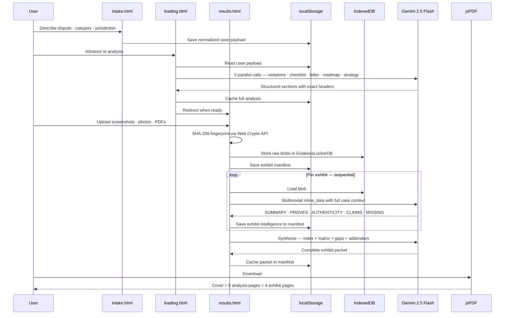

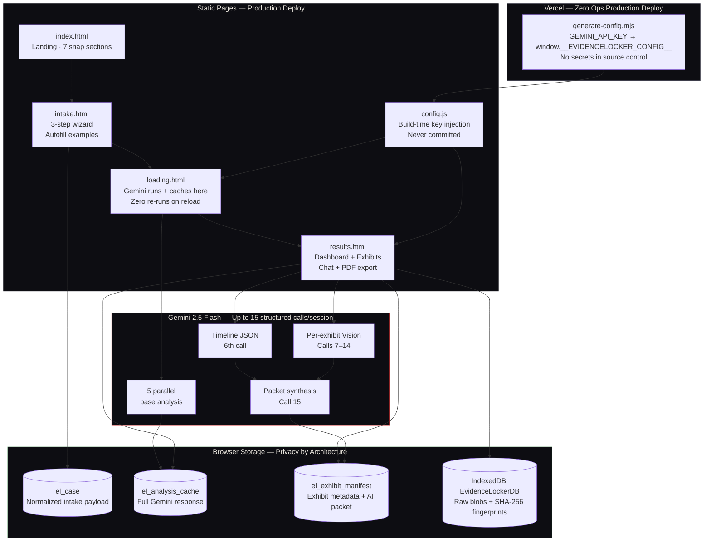

---

## <svg xmlns="http://www.w3.org/2000/svg" width="20" height="20" viewBox="0 0 24 24" fill="none" stroke="#C41E1E" stroke-width="2" stroke-linecap="round" stroke-linejoin="round" style="vertical-align:middle;margin-right:8px"><rect x="3" y="11" width="18" height="11" rx="2"/><path d="M7 11V7a5 5 0 0 1 10 0v4"/></svg> Scalability — Why No Backend

Every comparable product routes files through a server. EvidenceLocker uses a client-first architecture that turns zero infrastructure into a competitive moat.

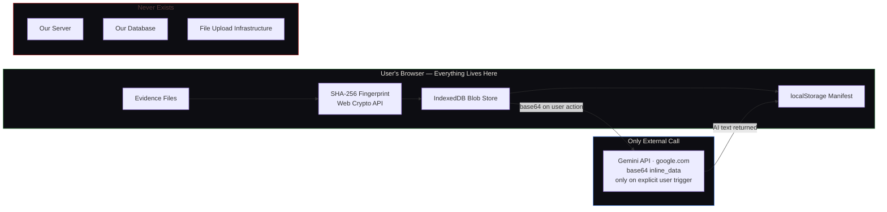

<table>
<tr>
<td><svg xmlns="http://www.w3.org/2000/svg" width="16" height="16" viewBox="0 0 24 24" fill="none" stroke="#22C55E" stroke-width="2.5" stroke-linecap="round" stroke-linejoin="round" style="vertical-align:middle"><polyline points="22 7 13.5 15.5 8.5 10.5 2 17"/><polyline points="16 7 22 7 22 13"/></svg> <strong>Infinite scale at zero cost</strong></td>
<td>Vercel free tier handles unlimited concurrent users — no servers to provision</td>
</tr>
<tr>
<td><svg xmlns="http://www.w3.org/2000/svg" width="16" height="16" viewBox="0 0 24 24" fill="none" stroke="#2D7A3A" stroke-width="2.5" stroke-linecap="round" stroke-linejoin="round" style="vertical-align:middle"><path d="M12 22s8-4 8-10V5l-8-3-8 3v7c0 6 8 10 8 10z"/></svg> <strong>Privacy by architecture</strong></td>
<td>Files never touch our infrastructure — impossible to breach or subpoena</td>
</tr>
<tr>
<td><svg xmlns="http://www.w3.org/2000/svg" width="16" height="16" viewBox="0 0 24 24" fill="none" stroke="#4285F4" stroke-width="2.5" stroke-linecap="round" stroke-linejoin="round" style="vertical-align:middle"><polyline points="13 17 18 12 13 7"/><polyline points="6 17 11 12 6 7"/></svg> <strong>Zero latency overhead</strong></td>
<td>API calls go browser → Google directly — no proxy hop, no added latency</td>
</tr>
<tr>
<td><svg xmlns="http://www.w3.org/2000/svg" width="16" height="16" viewBox="0 0 24 24" fill="none" stroke="#F59E0B" stroke-width="2.5" stroke-linecap="round" stroke-linejoin="round" style="vertical-align:middle"><line x1="12" y1="1" x2="12" y2="23"/><path d="M17 5H9.5a3.5 3.5 0 0 0 0 7h5a3.5 3.5 0 0 1 0 7H6"/></svg> <strong>~95% gross margin ceiling</strong></td>
<td>Only cost at scale is Gemini API calls — no servers, no DBs, no ops team</td>
</tr>
</table>

---

## <svg xmlns="http://www.w3.org/2000/svg" width="20" height="20" viewBox="0 0 24 24" fill="none" stroke="#C41E1E" stroke-width="2" stroke-linecap="round" stroke-linejoin="round" style="vertical-align:middle;margin-right:8px"><polygon points="13 2 3 14 12 14 11 22 21 10 12 10 13 2"/></svg> Exhibit Intelligence

The core product differentiator. Turns uploaded files into formal court-facing legal artifacts.

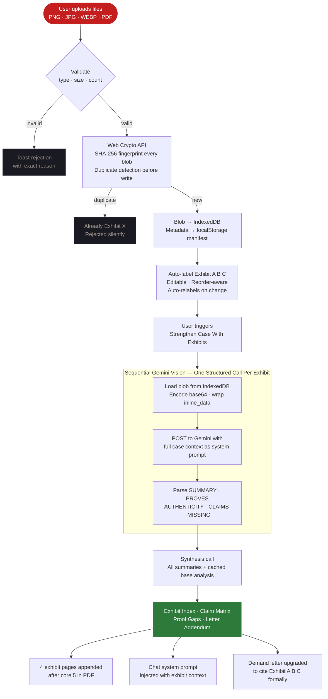

---

## <svg xmlns="http://www.w3.org/2000/svg" width="20" height="20" viewBox="0 0 24 24" fill="none" stroke="#C41E1E" stroke-width="2" stroke-linecap="round" stroke-linejoin="round" style="vertical-align:middle;margin-right:8px"><circle cx="12" cy="12" r="10"/><circle cx="12" cy="12" r="6"/><circle cx="12" cy="12" r="2"/></svg> Competitive Landscape

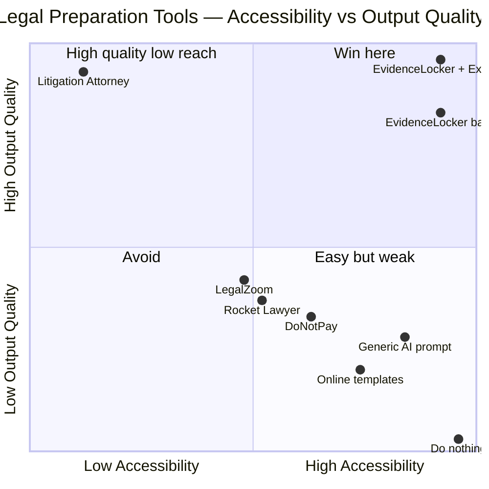

> Two data points for EvidenceLocker because Exhibit Intelligence is a discrete capability jump. With exhibits, output quality approaches a real attorney at $0 marginal cost per case.

---

## <svg xmlns="http://www.w3.org/2000/svg" width="20" height="20" viewBox="0 0 24 24" fill="none" stroke="#C41E1E" stroke-width="2" stroke-linecap="round" stroke-linejoin="round" style="vertical-align:middle;margin-right:8px"><line x1="8" y1="6" x2="21" y2="6"/><line x1="8" y1="12" x2="21" y2="12"/><line x1="8" y1="18" x2="21" y2="18"/><line x1="3" y1="6" x2="3.01" y2="6"/><line x1="3" y1="12" x2="3.01" y2="12"/><line x1="3" y1="18" x2="3.01" y2="18"/></svg> Full Feature Matrix

### <svg xmlns="http://www.w3.org/2000/svg" width="16" height="16" viewBox="0 0 24 24" fill="none" stroke="#C41E1E" stroke-width="2" stroke-linecap="round" stroke-linejoin="round" style="vertical-align:middle;margin-right:6px"><path d="M12 22s8-4 8-10V5l-8-3-8 3v7c0 6 8 10 8 10z"/></svg> Core Legal Analysis — 7 AI Outputs

| | Feature | What's Inside |
|:---:|---|---|
| `01` | **Violations Report** | Every statute by exact code. Federal + state + local. Penalty + remedy per violation. Case strength 0–100. |
| `02` | **Evidence Checklist** | 8–10 specific items. Exact preservation steps. Three flagged `[CRITICAL]`. Checkboxes persist to `localStorage`. |
| `03` | **Demand Letter** | Complete. Full citations. Exact amount. 14-day deadline. **Auto-upgraded to cite exhibits by formal label.** |
| `04` | **Filing Roadmap** | NLRB / EEOC / small claims — whichever applies. Fees, URLs, deadlines, exact word-for-word scripts. |
| `05` | **Case Strategy** | Success probability %. Settlement range. Recommended path. Leverage points. Their defenses + counters. |
| `06` | **Case Timeline** | 6th Gemini call. JSON milestones → scrollable horizontal timeline from Day 1 to resolution. |
| `07` | **AI Chat** | Case-aware assistant. Exhibit context injected into system prompt. References exhibits by label. |

### <svg xmlns="http://www.w3.org/2000/svg" width="16" height="16" viewBox="0 0 24 24" fill="none" stroke="#F0A500" stroke-width="2" stroke-linecap="round" stroke-linejoin="round" style="vertical-align:middle;margin-right:6px"><path d="M21.44 11.05l-9.19 9.19a6 6 0 0 1-8.49-8.49l9.19-9.19a4 4 0 0 1 5.66 5.66l-9.2 9.19a2 2 0 0 1-2.83-2.83l8.49-8.48"/></svg> Exhibit Intelligence — 4 Packet Outputs

| | Feature | What's Inside |
|:---:|---|---|
| `EX1` | **Exhibit Index** | Formal `Exhibit A / B / C` labeling. AI summary, proof value, authenticity notes. Reorder-aware. |
| `EX2` | **Claim Support Matrix** | Every case claim mapped to supporting exhibits. Coverage gaps surfaced immediately. |
| `EX3` | **Proof Gaps** | Missing evidence identified. How to obtain each. Prioritized by claim impact. |
| `EX4` | **Cited Letter Addendum** | Attorney-grade paragraphs citing exhibits by exact formal label. Ready to send. |

### <svg xmlns="http://www.w3.org/2000/svg" width="16" height="16" viewBox="0 0 24 24" fill="none" stroke="#2D7A3A" stroke-width="2" stroke-linecap="round" stroke-linejoin="round" style="vertical-align:middle;margin-right:6px"><circle cx="12" cy="12" r="3"/><path d="M19.07 4.93a10 10 0 0 1 0 14.14M4.93 4.93a10 10 0 0 0 0 14.14"/></svg> Infrastructure & Security

| Feature | Implementation | Detail |
|---|---|---|
| **Blob persistence** | `IndexedDB EvidenceLockerDB` | Files survive reload. Never leave the device. |
| **Deduplication** | `crypto.subtle.digest('SHA-256')` | Same file twice → `Already added as Exhibit X` — zero wasted API calls |
| **Manifest versioning** | `localStorage el_exhibit_manifest:${caseId}` | Reorder or remove → `packetValid: false` → forces regeneration |
| **Analysis caching** | `localStorage el_analysis_cache` | Gemini cached in `loading.html` — results render in ~2ms, not ~12,000ms |
| **API key security** | `generate-config.mjs` → `config.js` | `GEMINI_API_KEY` injected at Vercel build time — never in source control |
| **IDB fallback** | In-memory session storage | If IndexedDB unavailable → in-memory + user-visible toast warning |

---

## <svg xmlns="http://www.w3.org/2000/svg" width="20" height="20" viewBox="0 0 24 24" fill="none" stroke="#C41E1E" stroke-width="2" stroke-linecap="round" stroke-linejoin="round" style="vertical-align:middle;margin-right:8px"><polygon points="12 2 15.09 8.26 22 9.27 17 14.14 18.18 21.02 12 17.77 5.82 21.02 7 14.14 2 9.27 8.91 8.26 12 2"/></svg> Quantum Sprint Judging Criteria

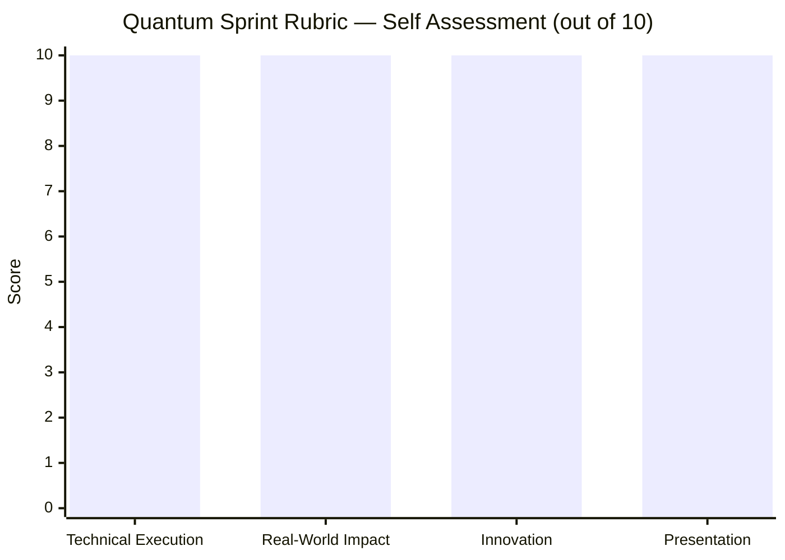

<details>
<summary><strong>Technical Execution — Code quality, architecture, scalability, performance, depth</strong></summary>

<br/>

* `Promise.allSettled()` fires 5 Gemini calls simultaneously on page load — real-time streaming into 5 DOM nodes at once
* `loading.html` caches full analysis before redirect — results page renders in ~2ms vs ~12,000ms cold run
* `IndexedDB` open/upgrade/transaction pattern for persistent exhibit blob storage across browser sessions
* `crypto.subtle.digest('SHA-256')` native Web Crypto fingerprinting — zero library dependency
* Gemini `inline_data` multimodal encoding — images and PDFs sent as base64 with exact mime type
* Sequential per-exhibit Vision calls with live status: `Stored → Analyzing → Analyzed → Failed`
* Manifest versioning — reorder or remove invalidates packet and forces clean regeneration
* `generate-config.mjs` injects `GEMINI_API_KEY` at Vercel build time via `window.__EVIDENCELOCKER_CONFIG__`
* jsPDF extended with 4 dark-themed exhibit pages, consistent case ID footer on every page
* Chat system prompt injection — exhibit labels, summaries, and proof gaps as context
* IDB graceful degradation to in-memory session storage with visible user toast
* SVG `stroke-dashoffset` severity ring with `easeOutCubic` over 1200ms
* 4-page wizard with `translateX` transitions at `cubic-bezier(0.4,0,0.2,1)`
* JS lerp cursor at 60fps via `requestAnimationFrame`
* **Production-deployed on Vercel. Live now. Not a prototype.**

</details>

<details>
<summary><strong>Real-World Impact & Feasibility — Market relevance, adoption, commercialization path</strong></summary>

<br/>

* **TAM:** 40M+ Americans in active legal disputes annually — deposit fraud, wage theft, contractor fraud
* **Existing tools fail this market:** LegalZoom costs $150+ per document. Attorneys cost $300–500/hr. Generic AI produces unstructured text.
* **EvidenceLocker removes every barrier:** no account, no legal knowledge, no cost, under 5 minutes
* **Operating cost at any scale:** Effectively $0 — pure static hosting, Gemini API costs only
* **Gross margin ceiling:** ~95% — no server costs, no DB costs, no ops
* **Commercial path:** Free → Pro ($9/mo) → Per-case ($19) → White-label (legal aid orgs)
* **Institutional channel:** White-label licensing for legal aid clinics, tenant rights groups, worker advocacy orgs
* **Systemic network effect:** When exhibit-cited demand letters become common, bad actors recalculate — product changes incentives at scale

</details>

<details>
<summary><strong>Innovation & Originality — Unique approach, forward-thinking, novel problem-solving</strong></summary>

<br/>

* Gemini used three architecturally distinct ways in one session: legal analysis, multimodal file review, packet synthesis
* **No comparable client-only product** combines IndexedDB blob storage + SHA-256 dedup + Vision API + jsPDF synthesis without a backend
* The exhibit pipeline treats uploaded files as **first-class legal artifacts** — not attachments, not references
* `loading.html` caches Gemini output before redirect — `results.html` is a pure render layer with zero AI calls
* Privacy-by-architecture: case data is physically impossible to breach because it never exists on a server
* Design language: nothing in legal tech looks like this — brutalist dark type, single red accent, vault animation, lerp cursor
* The demand letter upgrade from "I have evidence" to "Pursuant to Exhibit A" is a product insight, not a feature add

</details>

<details>
<summary><strong>Presentation & Product Clarity — Problem statement, demo quality, UX, communication</strong></summary>

<br/>

* Clear 4-stage product narrative with no ambiguity about what the product does or why
* 10-page PDF creates a **tangible artifact** — something physical a user can bring to a hearing
* Every Gemini call visible to the user: streaming text, per-exhibit status pills, top-of-page progress bar
* **The demo moment:** drop a screenshot → becomes `Exhibit A` → demand letter cites it by formal name
* Per-exhibit `Failed` state with individual retry — graceful degradation, no full-page crashes
* 7 scroll-snap landing page sections, structurally distinct, each building the case for the product
* Brutalist design signals: this is a tool built by someone who takes the problem seriously

</details>

---

## <svg xmlns="http://www.w3.org/2000/svg" width="20" height="20" viewBox="0 0 24 24" fill="none" stroke="#C41E1E" stroke-width="2" stroke-linecap="round" stroke-linejoin="round" style="vertical-align:middle;margin-right:8px"><line x1="18" y1="20" x2="18" y2="10"/><line x1="12" y1="20" x2="12" y2="4"/><line x1="6" y1="20" x2="6" y2="14"/></svg> Data

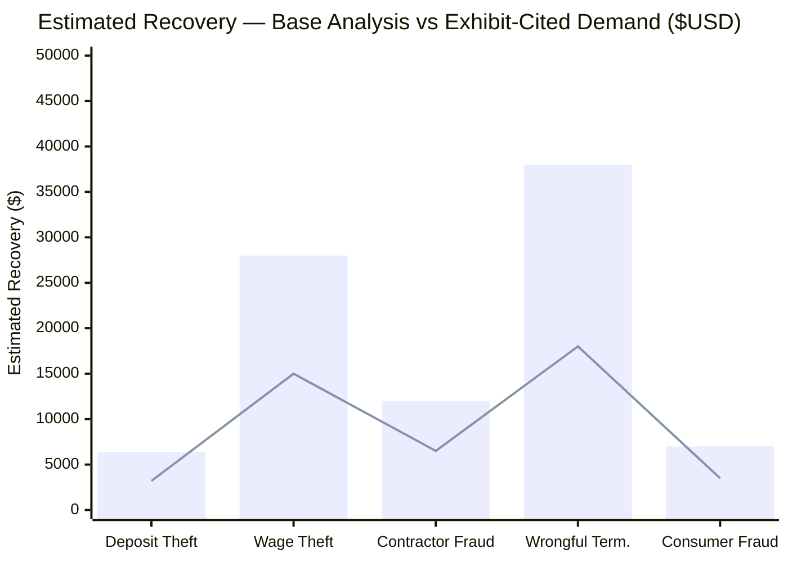

*Bar = with Exhibit Intelligence and cited demand letter. Line = base analysis only. Exhibits shift settlement calculus.*

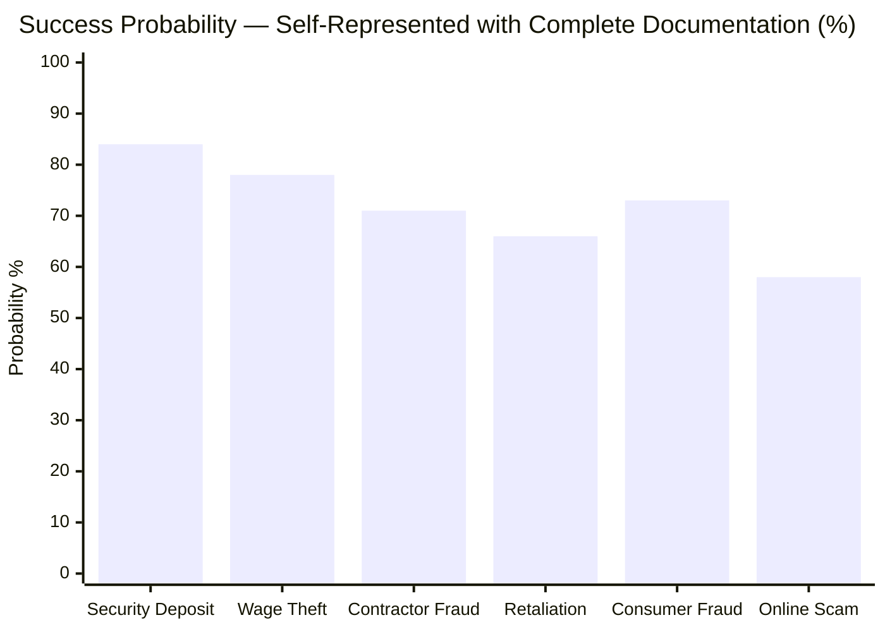

---

## <svg xmlns="http://www.w3.org/2000/svg" width="20" height="20" viewBox="0 0 24 24" fill="none" stroke="#C41E1E" stroke-width="2" stroke-linecap="round" stroke-linejoin="round" style="vertical-align:middle;margin-right:8px"><circle cx="12" cy="12" r="10"/><polyline points="12 6 12 12 16 14"/></svg> Product Journey

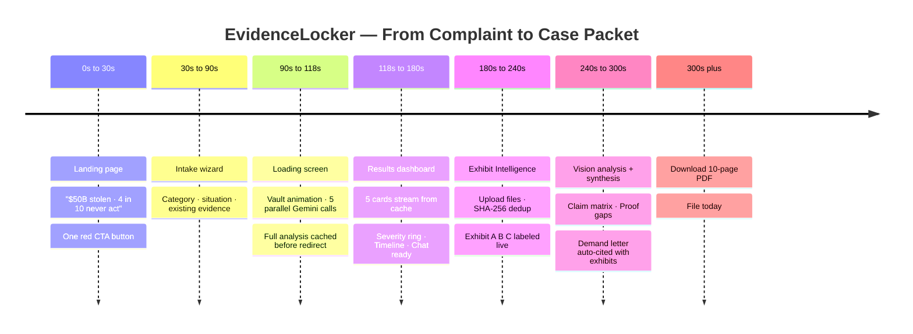

---

## <svg xmlns="http://www.w3.org/2000/svg" width="20" height="20" viewBox="0 0 24 24" fill="none" stroke="#C41E1E" stroke-width="2" stroke-linecap="round" stroke-linejoin="round" style="vertical-align:middle;margin-right:8px"><polygon points="12 2 15.09 8.26 22 9.27 17 14.14 18.18 21.02 12 17.77 5.82 21.02 7 14.14 2 9.27 8.91 8.26 12 2"/></svg> Roadmap

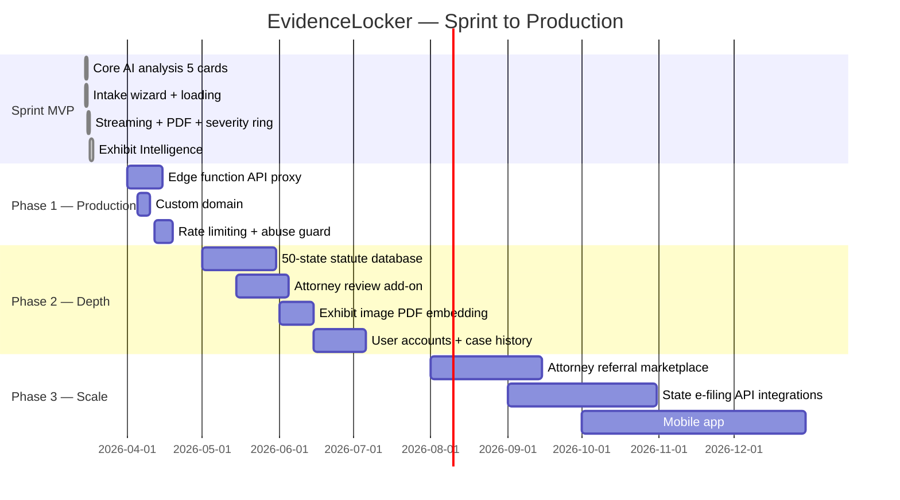

---

## <svg xmlns="http://www.w3.org/2000/svg" width="20" height="20" viewBox="0 0 24 24" fill="none" stroke="#C41E1E" stroke-width="2" stroke-linecap="round" stroke-linejoin="round" style="vertical-align:middle;margin-right:8px"><circle cx="12" cy="12" r="3"/><path d="M12 1v2M12 21v2M4.22 4.22l1.42 1.42M18.36 18.36l1.42 1.42M1 12h2M21 12h2M4.22 19.78l1.42-1.42M18.36 5.64l1.42-1.42"/></svg> Setup

```bash
# Vercel — add environment variable in project dashboard:
GEMINI_API_KEY = your_key_here

# Build command (auto-runs on push):
node scripts/generate-config.mjs

# App reads: window.__EVIDENCELOCKER_CONFIG__.apiKey
```

```powershell
# Local development (PowerShell):
$env:GEMINI_API_KEY = "your_key_here"
node scripts/generate-config.mjs
# Open public/index.html in browser
```

**Get a free Gemini API key:** [aistudio.google.com](https://aistudio.google.com) — no credit card.

---

## License

MIT

---

<div align="center">

<svg xmlns="http://www.w3.org/2000/svg" width="48" height="48" viewBox="0 0 24 24" fill="none" stroke="#C41E1E" stroke-width="1.5" stroke-linecap="round" stroke-linejoin="round"><rect x="3" y="11" width="18" height="11" rx="2" ry="2"/><path d="M7 11V7a5 5 0 0 1 10 0v4"/><circle cx="12" cy="16" r="1" fill="#C41E1E"/></svg>

---

```
40 million people have evidence.
Almost none of them have a case packet.

EvidenceLocker closes that gap.
At scale. For free. Right now.
```

**Plain language → formal exhibits → cited demand → 10-page PDF**

**Production-deployed · Zero backend · ~95% gross margin · Ships to 40M users on free tier**

---

<a href="https://evidencelocker.vercel.app">
  
</a>

<br/><br/>

*Built with intent. Shipped with confidence.*

</div>
