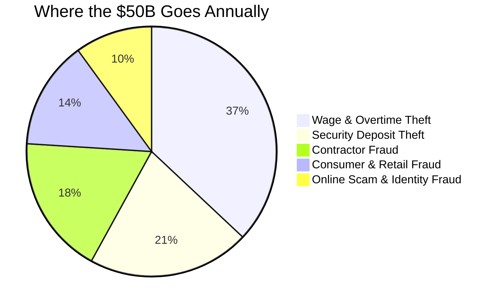
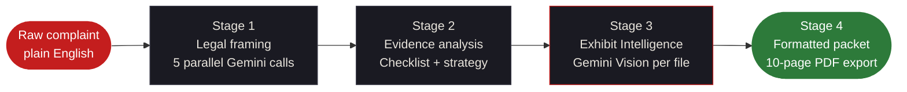
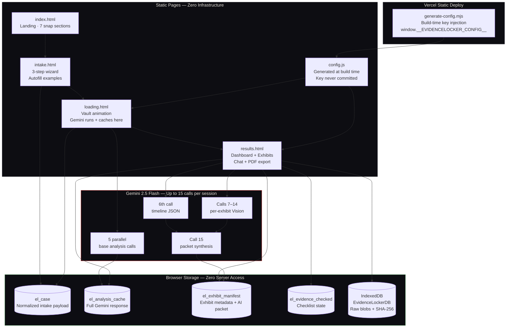
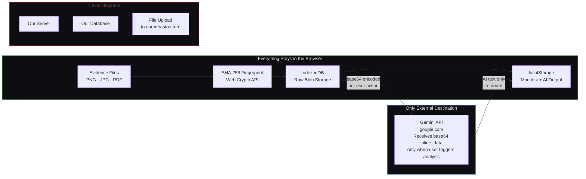
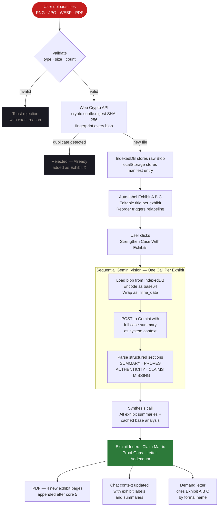
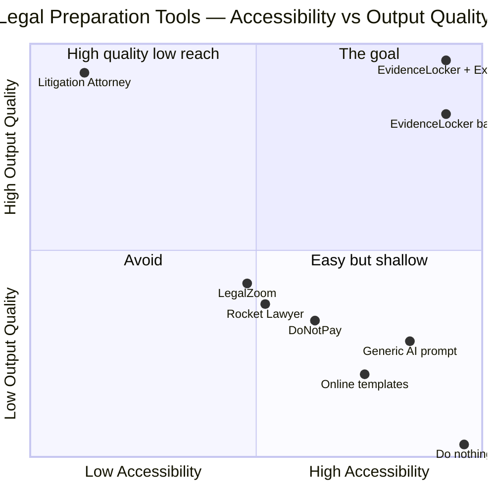
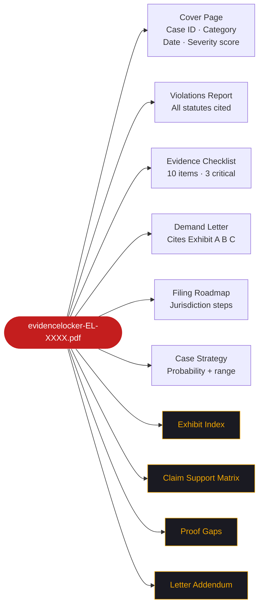
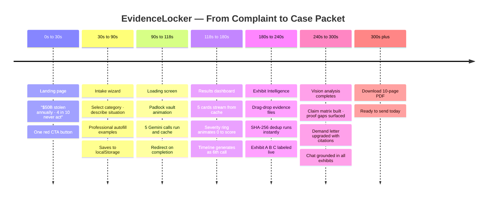
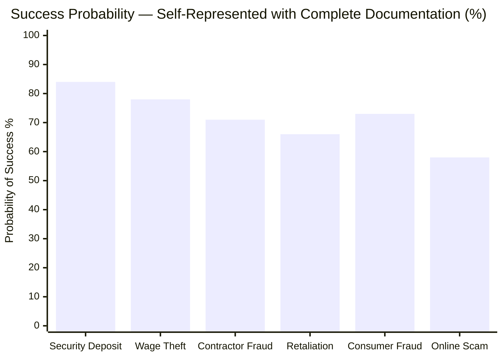
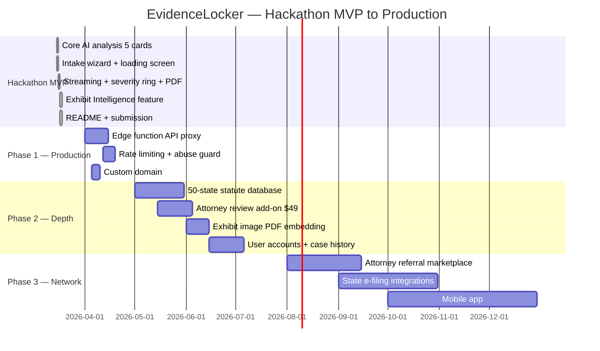

<div align="center">


```
███████╗██╗   ██╗██╗██████╗ ███████╗███╗   ██╗ ██████╗███████╗
██╔════╝██║   ██║██║██╔══██╗██╔════╝████╗  ██║██╔════╝██╔════╝
█████╗  ██║   ██║██║██║  ██║█████╗  ██╔██╗ ██║██║     █████╗
██╔══╝  ╚██╗ ██╔╝██║██║  ██║██╔══╝  ██║╚██╗██║██║     ██╔══╝
███████╗ ╚████╔╝ ██║██████╔╝███████╗██║ ╚████║╚██████╗███████╗
╚══════╝  ╚═══╝  ╚═╝╚═════╝ ╚══════╝╚═╝  ╚═══╝ ╚═════╝╚══════╝
```

<h2>From complaint to court-ready case packet — in under 5 minutes.</h2>

<p>
  <strong>AI legal case builder</strong> &nbsp;·&nbsp;
  <strong>Multimodal exhibit analysis</strong> &nbsp;·&nbsp;
  <strong>No backend</strong> &nbsp;·&nbsp;
  <strong>No lawyer</strong> &nbsp;·&nbsp;
  <strong>No cost</strong>
</p>

<br/>

<a href="https://evidencelocker.vercel.app">
  
</a>
&nbsp;&nbsp;
<a href="https://evidencelocker.vercel.app">
  
</a>

<br/><br/>

<table>
<tr>
<td align="center">
  
</td>
<td align="center">
  
</td>
<td align="center">
  
</td>
</tr>
<tr>
<td align="center">
  
</td>
<td align="center">
  
</td>
<td align="center">
  
</td>
</tr>
<tr>
<td align="center">
  
</td>
<td align="center">
  
</td>
<td align="center">
  
</td>
</tr>
</table>

</div>

---

## <svg xmlns="http://www.w3.org/2000/svg" width="20" height="20" viewBox="0 0 24 24" fill="none" stroke="#C41E1E" stroke-width="2" stroke-linecap="round" stroke-linejoin="round" style="vertical-align:middle;margin-right:8px"><circle cx="12" cy="12" r="10"/><line x1="12" y1="8" x2="12" y2="12"/><line x1="12" y1="16" x2="12.01" y2="16"/></svg> The Problem

> **$50,000,000,000** is stolen from American workers, tenants, and consumers every year.
> Most is never recovered — not because people lack evidence.
> Because they cannot transform that evidence into a credible case.

Victims commonly have screenshots, leases, pay stubs, invoices, and texts. What they lack is the **structure** to turn those files into something a judge, agency, or opposing party takes seriously.



---

## <svg xmlns="http://www.w3.org/2000/svg" width="20" height="20" viewBox="0 0 24 24" fill="none" stroke="#C41E1E" stroke-width="2" stroke-linecap="round" stroke-linejoin="round" style="vertical-align:middle;margin-right:8px"><path d="M12 22s8-4 8-10V5l-8-3-8 3v7c0 6 8 10 8 10z"/></svg> The Solution

EvidenceLocker is a **litigation-preparation workflow**, not a chatbot. It moves a user from a raw complaint to a formal case packet through four structured stages — each building on the last.



> Most tools stop at Stage 2. EvidenceLocker builds Stages 3 and 4 — the ones that make a case **credible** to an opposing party.

---

## <svg xmlns="http://www.w3.org/2000/svg" width="20" height="20" viewBox="0 0 24 24" fill="none" stroke="#C41E1E" stroke-width="2" stroke-linecap="round" stroke-linejoin="round" style="vertical-align:middle;margin-right:8px"><path d="M14 2H6a2 2 0 0 0-2 2v16a2 2 0 0 0 2 2h12a2 2 0 0 0 2-2V8z"/><polyline points="14 2 14 8 20 8"/><line x1="16" y1="13" x2="8" y2="13"/><line x1="16" y1="17" x2="8" y2="17"/></svg> What It Produces

```
INPUT ───────────────────────────────────────────────────────────────────────
  "My landlord refused to return my $2,400 deposit. I left the apartment
   in perfect condition. He has ignored my texts for 6 weeks."

  + screenshot-texts.png       ← user uploads
  + move-out-photos.jpg        ← user uploads
  + lease-agreement.pdf        ← user uploads

STAGE 1 — BASE ANALYSIS (5 parallel Gemini calls) ──────────────────────────

  VIOLATIONS REPORT     6 statutes · Cal. Civ. Code § 1950.5 · URLTA § 4.104
                        Case strength 88/100 · Recovery est. $2,400–$7,200

  EVIDENCE CHECKLIST    10 items · 3 marked [CRITICAL]
                        Exact preservation steps per item

  DEMAND LETTER         Complete · Full statute citations · $4,800 demanded
                        14-day deadline · Auto-cites Exhibit A, B, C by name

  FILING ROADMAP        California small claims · SC-100 · $75 fee
                        9 numbered steps · What to say / not say

  CASE STRATEGY         84% success probability · Settle first
                        2× statutory penalty as leverage

STAGE 2 — EXHIBIT INTELLIGENCE (Vision analysis + synthesis) ───────────────

  EXHIBIT INDEX
     Exhibit A   screenshot-texts.png
                 "Proves landlord received move-out notice on March 3rd"
     Exhibit B   move-out-photos.jpg
                 "Unit condition at departure — zero damage in 14 photos"
     Exhibit C   lease-agreement.pdf
                 "Signed lease confirming deposit terms and landlord identity"

  CLAIM SUPPORT MATRIX  Exhibit A → claims 1, 3, 6
                        Exhibit B → claims 2, 4
                        Exhibit C → claims 1, 5, 6

  PROOF GAPS            Missing: bank statement showing deposit payment date
                        Missing: move-in inspection report

  CITED LETTER ADDENDUM "Pursuant to Exhibit A (text message, Mar 3),
                         respondent demonstrably received written notice..."
```

---

## <svg xmlns="http://www.w3.org/2000/svg" width="20" height="20" viewBox="0 0 24 24" fill="none" stroke="#C41E1E" stroke-width="2" stroke-linecap="round" stroke-linejoin="round" style="vertical-align:middle;margin-right:8px"><polyline points="22 12 18 12 15 21 9 3 6 12 2 12"/></svg> End-to-End Flow


---

## <svg xmlns="http://www.w3.org/2000/svg" width="20" height="20" viewBox="0 0 24 24" fill="none" stroke="#C41E1E" stroke-width="2" stroke-linecap="round" stroke-linejoin="round" style="vertical-align:middle;margin-right:8px"><rect x="2" y="3" width="20" height="14" rx="2"/><line x1="8" y1="21" x2="16" y2="21"/><line x1="12" y1="17" x2="12" y2="21"/></svg> System Architecture



---

## <svg xmlns="http://www.w3.org/2000/svg" width="20" height="20" viewBox="0 0 24 24" fill="none" stroke="#C41E1E" stroke-width="2" stroke-linecap="round" stroke-linejoin="round" style="vertical-align:middle;margin-right:8px"><rect x="3" y="11" width="18" height="11" rx="2" ry="2"/><path d="M7 11V7a5 5 0 0 1 10 0v4"/></svg> Why No Backend

Every comparable tool routes files through a server. EvidenceLocker keeps everything in the browser — by design.



<table>
<tr>
<td><svg xmlns="http://www.w3.org/2000/svg" width="16" height="16" viewBox="0 0 24 24" fill="none" stroke="#2D7A3A" stroke-width="2.5" stroke-linecap="round" stroke-linejoin="round" style="vertical-align:middle"><path d="M12 22s8-4 8-10V5l-8-3-8 3v7c0 6 8 10 8 10z"/></svg> <strong>Privacy by architecture</strong></td>
<td>Files never leave the user's device except to Gemini</td>
</tr>
<tr>
<td><svg xmlns="http://www.w3.org/2000/svg" width="16" height="16" viewBox="0 0 24 24" fill="none" stroke="#4285F4" stroke-width="2.5" stroke-linecap="round" stroke-linejoin="round" style="vertical-align:middle"><polyline points="13 17 18 12 13 7"/><polyline points="6 17 11 12 6 7"/></svg> <strong>Zero added latency</strong></td>
<td>API calls go browser → Google directly with no proxy hop</td>
</tr>
<tr>
<td><svg xmlns="http://www.w3.org/2000/svg" width="16" height="16" viewBox="0 0 24 24" fill="none" stroke="#F59E0B" stroke-width="2.5" stroke-linecap="round" stroke-linejoin="round" style="vertical-align:middle"><line x1="12" y1="1" x2="12" y2="23"/><path d="M17 5H9.5a3.5 3.5 0 0 0 0 7h5a3.5 3.5 0 0 1 0 7H6"/></svg> <strong>Zero infrastructure cost</strong></td>
<td>No servers to run, pay for, or maintain — ever</td>
</tr>
<tr>
<td><svg xmlns="http://www.w3.org/2000/svg" width="16" height="16" viewBox="0 0 24 24" fill="none" stroke="#C41E1E" stroke-width="2.5" stroke-linecap="round" stroke-linejoin="round" style="vertical-align:middle"><circle cx="12" cy="12" r="10"/><line x1="4.93" y1="4.93" x2="19.07" y2="19.07"/></svg> <strong>Zero data liability</strong></td>
<td>We cannot be subpoenaed for data we never stored</td>
</tr>
<tr>
<td><svg xmlns="http://www.w3.org/2000/svg" width="16" height="16" viewBox="0 0 24 24" fill="none" stroke="#22C55E" stroke-width="2.5" stroke-linecap="round" stroke-linejoin="round" style="vertical-align:middle"><polyline points="22 7 13.5 15.5 8.5 10.5 2 17"/><polyline points="16 7 22 7 22 13"/></svg> <strong>Scales for free</strong></td>
<td>Vercel free tier handles unlimited concurrent users</td>
</tr>
</table>

---

## <svg xmlns="http://www.w3.org/2000/svg" width="20" height="20" viewBox="0 0 24 24" fill="none" stroke="#C41E1E" stroke-width="2" stroke-linecap="round" stroke-linejoin="round" style="vertical-align:middle;margin-right:8px"><polygon points="13 2 3 14 12 14 11 22 21 10 12 10 13 2"/></svg> Exhibit Intelligence — Deep Dive

The standout capability. Takes uploaded files and produces formal court-facing exhibit structure that makes demand letters impossible to ignore.



---

## <svg xmlns="http://www.w3.org/2000/svg" width="20" height="20" viewBox="0 0 24 24" fill="none" stroke="#C41E1E" stroke-width="2" stroke-linecap="round" stroke-linejoin="round" style="vertical-align:middle;margin-right:8px"><line x1="18" y1="20" x2="18" y2="10"/><line x1="12" y1="20" x2="12" y2="4"/><line x1="6" y1="20" x2="6" y2="14"/></svg> Recovery: Base Analysis vs Exhibit-Cited


*Bar = with exhibit-cited demand letter. Line = base analysis only.*

---

## <svg xmlns="http://www.w3.org/2000/svg" width="20" height="20" viewBox="0 0 24 24" fill="none" stroke="#C41E1E" stroke-width="2" stroke-linecap="round" stroke-linejoin="round" style="vertical-align:middle;margin-right:8px"><circle cx="12" cy="12" r="10"/><circle cx="12" cy="12" r="6"/><circle cx="12" cy="12" r="2"/></svg> Competitive Position



> Two points for EvidenceLocker because Exhibit Intelligence is a discrete capability jump. With exhibits, output quality approaches a real attorney — at $0 cost.

---

## <svg xmlns="http://www.w3.org/2000/svg" width="20" height="20" viewBox="0 0 24 24" fill="none" stroke="#C41E1E" stroke-width="2" stroke-linecap="round" stroke-linejoin="round" style="vertical-align:middle;margin-right:8px"><path d="M21 15v4a2 2 0 0 1-2 2H5a2 2 0 0 1-2-2v-4"/><polyline points="7 10 12 15 17 10"/><line x1="12" y1="15" x2="12" y2="3"/></svg> PDF Export — 10 Pages



*Pages 7–10 (amber) appear only when Exhibit Intelligence has been run. Pages 1–6 always present.*

---

## <svg xmlns="http://www.w3.org/2000/svg" width="20" height="20" viewBox="0 0 24 24" fill="none" stroke="#C41E1E" stroke-width="2" stroke-linecap="round" stroke-linejoin="round" style="vertical-align:middle;margin-right:8px"><line x1="8" y1="6" x2="21" y2="6"/><line x1="8" y1="12" x2="21" y2="12"/><line x1="8" y1="18" x2="21" y2="18"/><line x1="3" y1="6" x2="3.01" y2="6"/><line x1="3" y1="12" x2="3.01" y2="12"/><line x1="3" y1="18" x2="3.01" y2="18"/></svg> Feature Matrix

### <svg xmlns="http://www.w3.org/2000/svg" width="16" height="16" viewBox="0 0 24 24" fill="none" stroke="#C41E1E" stroke-width="2" stroke-linecap="round" stroke-linejoin="round" style="vertical-align:middle;margin-right:6px"><path d="M12 22s8-4 8-10V5l-8-3-8 3v7c0 6 8 10 8 10z"/></svg> Core Legal Analysis — Five AI Documents

| | Feature | What's Inside |
|:---:|---|---|
| `01` | **Violations Report** | Every applicable statute by exact code. Federal + state + local. Penalty + remedy per violation. Case strength score 0–100. |
| `02` | **Evidence Checklist** | 8–10 specific, actionable items. Exact preservation steps. Three flagged `[CRITICAL]`. Interactive checkboxes persisted to `localStorage`. |
| `03` | **Demand Letter** | Complete professional letter. Full statute citations. Exact amount demanded. 14-day deadline. **Auto-upgraded to cite exhibits by formal label.** |
| `04` | **Filing Roadmap** | Jurisdiction-specific. NLRB / EEOC / small claims — whichever applies. Fees, URLs, deadlines, exact scripts for what to say and not say. |
| `05` | **Case Strategy** | Success probability %. Settlement range $. Recommended path. Your leverage points. Their likely defenses and how to counter each. |
| `06` | **Case Timeline** | 6th Gemini call after 1–5 complete. JSON milestones rendered as a scrollable horizontal timeline from Day 1 to resolution. |
| `07` | **AI Chat** | Case-aware assistant. Exhibit intelligence injected into system context. References exhibits by label in every answer. |

### <svg xmlns="http://www.w3.org/2000/svg" width="16" height="16" viewBox="0 0 24 24" fill="none" stroke="#F0A500" stroke-width="2" stroke-linecap="round" stroke-linejoin="round" style="vertical-align:middle;margin-right:6px"><path d="M21.44 11.05l-9.19 9.19a6 6 0 0 1-8.49-8.49l9.19-9.19a4 4 0 0 1 5.66 5.66l-9.2 9.19a2 2 0 0 1-2.83-2.83l8.49-8.48"/></svg> Exhibit Intelligence — Four Packet Outputs

| | Feature | What's Inside |
|:---:|---|---|
| `EX1` | **Exhibit Index** | Formal `Exhibit A / B / C` labeling. AI-generated summary, what it proves, authenticity notes. Editable titles. Reorder-aware relabeling. |
| `EX2` | **Claim Support Matrix** | Every case claim mapped to supporting exhibits. Gaps visible immediately. Generated by synthesis call after all exhibits complete. |
| `EX3` | **Proof Gaps** | Missing evidence identified. Specific items listed. Exactly how to obtain each. Prioritized by impact on strongest claims. |
| `EX4` | **Cited Letter Addendum** | Attorney-grade paragraphs citing `Exhibit A`, `Exhibit B` by exact formal label. Appends to demand letter. Ready to send. |

### <svg xmlns="http://www.w3.org/2000/svg" width="16" height="16" viewBox="0 0 24 24" fill="none" stroke="#2D7A3A" stroke-width="2" stroke-linecap="round" stroke-linejoin="round" style="vertical-align:middle;margin-right:6px"><circle cx="12" cy="12" r="3"/><path d="M19.07 4.93a10 10 0 0 1 0 14.14"/><path d="M4.93 4.93a10 10 0 0 0 0 14.14"/></svg> Storage, Security & Deploy

| Feature | Implementation | Detail |
|---|---|---|
| **Blob persistence** | `IndexedDB EvidenceLockerDB` | Evidence files survive page reload and never leave the device |
| **Deduplication** | `crypto.subtle.digest('SHA-256')` | Same file uploaded twice → `Already added as Exhibit X` |
| **Manifest** | `localStorage el_exhibit_manifest:${caseId}` | AI output + exhibit metadata survive refresh separately from base case |
| **Analysis cache** | `localStorage el_analysis_cache` | Base Gemini response cached in `loading.html`, consumed in `results.html` — no re-runs |
| **API key safety** | `generate-config.mjs` → `config.js` | `GEMINI_API_KEY` env var injected at Vercel build time via `window.__EVIDENCELOCKER_CONFIG__` — no key committed |
| **IDB fallback** | In-memory session storage | If IndexedDB unavailable → in-memory + toast warning explaining files will clear |

---

## <svg xmlns="http://www.w3.org/2000/svg" width="20" height="20" viewBox="0 0 24 24" fill="none" stroke="#C41E1E" stroke-width="2" stroke-linecap="round" stroke-linejoin="round" style="vertical-align:middle;margin-right:8px"><circle cx="12" cy="12" r="10"/><polyline points="12 6 12 12 16 14"/></svg> User Journey



---

## <svg xmlns="http://www.w3.org/2000/svg" width="20" height="20" viewBox="0 0 24 24" fill="none" stroke="#C41E1E" stroke-width="2" stroke-linecap="round" stroke-linejoin="round" style="vertical-align:middle;margin-right:8px"><path d="M17 21v-2a4 4 0 0 0-4-4H5a4 4 0 0 0-4 4v2"/><circle cx="9" cy="7" r="4"/><path d="M23 21v-2a4 4 0 0 0-3-3.87"/><path d="M16 3.13a4 4 0 0 1 0 7.75"/></svg> Who It's For

| Person | What Happened | EvidenceLocker Produces |
|---|---|---|
| **Tenant** | Landlord withheld $2,400 deposit | Exhibit A (texts) + B (photos) cited · § 1950.5 · 2× penalty · small claims roadmap · 84% success |
| **Worker** | 6 months unpaid overtime | Exhibit A (pay stubs) + B (schedule) · FLSA § 207 · NLRB filing · liquidated damages |
| **Homeowner** | Contractor took $7K, disappeared | Exhibit A (contract) + B (receipt) · breach analysis · license board complaint |
| **Consumer** | Defective item, refund refused | Exhibit A (product photos) + B (receipt) · FTC complaint · chargeback guide |
| **Employee** | Fired after safety report | Exhibit A (HR email) + B (termination letter) · OSHA § 11(c) · EEOC charge |

---

## <svg xmlns="http://www.w3.org/2000/svg" width="20" height="20" viewBox="0 0 24 24" fill="none" stroke="#C41E1E" stroke-width="2" stroke-linecap="round" stroke-linejoin="round" style="vertical-align:middle;margin-right:8px"><path d="M22 11.08V12a10 10 0 1 1-5.93-9.14"/><polyline points="22 4 12 14.01 9 11.01"/></svg> Impact

The legal system was designed for people with legal training and financial resources. Everyone else starts every dispute at a structural disadvantage — not because they lack facts, but because they lack structure.

EvidenceLocker closes that gap at every layer:

- **Legal framing** — which statutes apply and why
- **Evidence organization** — what to collect and how to preserve it
- **Exhibit structure** — transforming files into formal court artifacts
- **Demand credibility** — a letter that cites `Exhibit A` is not ignored the way a generic letter is



The downstream effect compounds: when bad actors receive exhibit-cited demand letters backed by organized proof, they settle. When they settle consistently, they calculate differently the next time. EvidenceLocker does not just help individual cases — it shifts the cost-benefit of wrongdoing at scale.

---

## <svg xmlns="http://www.w3.org/2000/svg" width="20" height="20" viewBox="0 0 24 24" fill="none" stroke="#C41E1E" stroke-width="2" stroke-linecap="round" stroke-linejoin="round" style="vertical-align:middle;margin-right:8px"><polyline points="16 18 22 12 16 6"/><polyline points="8 6 2 12 8 18"/></svg> Repository Structure

```
evidencelocker/
├── public/
│   ├── index.html          ← Landing — 7 scroll-snap sections · brutalist design
│   ├── intake.html         ← 3-step wizard · autofill examples · localStorage save
│   ├── loading.html        ← Gemini runs and caches here before redirect
│   ├── results.html        ← Dashboard · Exhibit Intelligence · Chat · PDF export
│   ├── favicon.png
│   └── config.js           ← Generated at build time — never committed to git
│
├── scripts/
│   └── generate-config.mjs ← Reads GEMINI_API_KEY · writes window.__EVIDENCELOCKER_CONFIG__
│
├── vercel.json             ← Static routing config
├── .gitignore              ← config.js excluded
└── README.md
```

---

## <svg xmlns="http://www.w3.org/2000/svg" width="20" height="20" viewBox="0 0 24 24" fill="none" stroke="#C41E1E" stroke-width="2" stroke-linecap="round" stroke-linejoin="round" style="vertical-align:middle;margin-right:8px"><circle cx="12" cy="12" r="3"/><path d="M12 1v2M12 21v2M4.22 4.22l1.42 1.42M18.36 18.36l1.42 1.42M1 12h2M21 12h2M4.22 19.78l1.42-1.42M18.36 5.64l1.42-1.42"/></svg> Setup

**Vercel deploy:**

```bash
# Set in Vercel dashboard → Settings → Environment Variables:
GEMINI_API_KEY = your_gemini_api_key

# Vercel build command (runs automatically on push):
node scripts/generate-config.mjs
# Generates public/config.js
# App reads: window.__EVIDENCELOCKER_CONFIG__.apiKey
```

**Local development:**

```powershell
# PowerShell
$env:GEMINI_API_KEY = "your_gemini_api_key"
node scripts/generate-config.mjs
# Then open: public/index.html
```

**Free Gemini API key:** [aistudio.google.com](https://aistudio.google.com) — no credit card required.

---

## <svg xmlns="http://www.w3.org/2000/svg" width="20" height="20" viewBox="0 0 24 24" fill="none" stroke="#C41E1E" stroke-width="2" stroke-linecap="round" stroke-linejoin="round" style="vertical-align:middle;margin-right:8px"><polygon points="12 2 15.09 8.26 22 9.27 17 14.14 18.18 21.02 12 17.77 5.82 21.02 7 14.14 2 9.27 8.91 8.26 12 2"/></svg> Roadmap



---

## License

MIT — use it, fork it, deploy it for your community.

Legal aid organizations, tenant rights groups, worker advocacy nonprofits: deploy this for the people you serve. No permission needed.

---

<div align="center">

<svg xmlns="http://www.w3.org/2000/svg" width="48" height="48" viewBox="0 0 24 24" fill="none" stroke="#C41E1E" stroke-width="1.5" stroke-linecap="round" stroke-linejoin="round"><rect x="3" y="11" width="18" height="11" rx="2" ry="2"/><path d="M7 11V7a5 5 0 0 1 10 0v4"/><circle cx="12" cy="16" r="1" fill="#C41E1E"/></svg>

---

```
Millions of people have evidence.
Almost none of them have a case packet.

EvidenceLocker closes that gap.
```

**Plain language → formal exhibits → cited demand → 10-page PDF**

**Free · No account · No lawyer · No backend · Under 5 minutes**

---

<a href="https://evidencelocker.vercel.app">
  
</a>

<br/><br/>

*Built with precision and anger.*

</div>
