<div align="center">

```
███████╗██╗   ██╗██╗██████╗ ███████╗███╗   ██╗ ██████╗███████╗
██╔════╝██║   ██║██║██╔══██╗██╔════╝████╗  ██║██╔════╝██╔════╝
█████╗  ██║   ██║██║██║  ██║█████╗  ██╔██╗ ██║██║     █████╗
██╔══╝  ╚██╗ ██╔╝██║██║  ██║██╔══╝  ██║╚██╗██║██║     ██╔══╝
███████╗ ╚████╔╝ ██║██████╔╝███████╗██║ ╚████║╚██████╗███████╗
╚══════╝  ╚═══╝  ╚═╝╚═════╝ ╚══════╝╚═╝  ╚═══╝ ╚═════╝╚══════╝
```

<h3>From complaint to court-ready case packet — in under 5 minutes.</h3>
<p><em>AI legal case builder · Multimodal exhibit analysis · No backend · No lawyer · No cost</em></p>

---

<a href="https://evidencelocker.vercel.app"></a>
&nbsp;
<a href="#"></a>

---


</div>

---

## The Problem

> **$50,000,000,000** is stolen from American workers, tenants, and consumers every year.
> Most of it is never recovered — not because people lack evidence.
> Because they cannot transform evidence into a credible case.

Victims commonly have screenshots, leases, pay stubs, invoices, texts. What they lack is the structure to turn those files into something a judge, agency, or opposing party takes seriously.

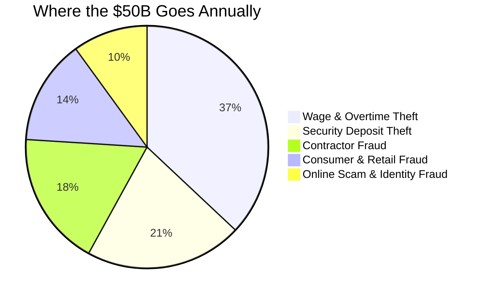

---

## The Solution

EvidenceLocker is a **litigation-preparation workflow**, not a chatbot.

It moves a user from raw complaint to formal case packet through four structured stages — each building on the last:

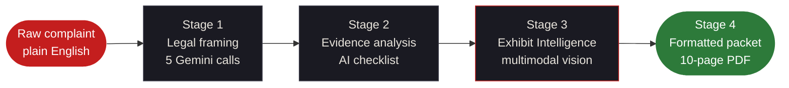

The key distinction: most tools stop at Stage 2. EvidenceLocker builds Stages 3 and 4 — the ones that actually make a case **credible** to an opposing party.

---

## What It Produces

```
INPUT ───────────────────────────────────────────────────────────────────
  "My landlord refused to return my $2,400 deposit. Left the apartment
   in perfect condition. He's ignored my texts for 6 weeks."

  + screenshot-texts.png       ← user uploads
  + move-out-photos.jpg        ← user uploads
  + lease-agreement.pdf        ← user uploads

STAGE 1: BASE ANALYSIS (5 parallel Gemini calls) ────────────────────────

  VIOLATIONS REPORT       6 statutes violated
                          Cal. Civ. Code § 1950.5 · URLTA § 4.104 · 4 more
                          Case strength 88/100 · Recovery est. $2,400–$7,200

  EVIDENCE CHECKLIST      10 items · 3 marked [CRITICAL]
                          Exact preservation steps per item

  DEMAND LETTER           Complete · Full citations · $4,800 demanded
                          14-day deadline · Ready to print today

  FILING ROADMAP          California small claims · SC-100 · $75 fee
                          9 numbered steps · What to say / not say

  CASE STRATEGY           84% success probability
                          Settle first · 2× statutory leverage

STAGE 2: EXHIBIT INTELLIGENCE (per-exhibit Gemini Vision + synthesis) ───

  EXHIBIT INDEX
    Exhibit A   screenshot-texts.png
                "Proves landlord received move-out notice on March 3rd"
    Exhibit B   move-out-photos.jpg
                "Unit condition at departure — zero damage in 14 photos"
    Exhibit C   lease-agreement.pdf
                "Signed lease confirming deposit terms and landlord identity"

  CLAIM SUPPORT MATRIX    Exhibit A → claims 1, 3, 6
                          Exhibit B → claims 2, 4
                          Exhibit C → claims 1, 5, 6

  PROOF GAPS              Missing: bank statement showing deposit payment
                          Missing: move-in inspection report

  CITED LETTER ADDENDUM   "Pursuant to Exhibit A (text message, Mar 3),
                           respondent demonstrably received written notice..."
```

---

## End-to-End Architecture

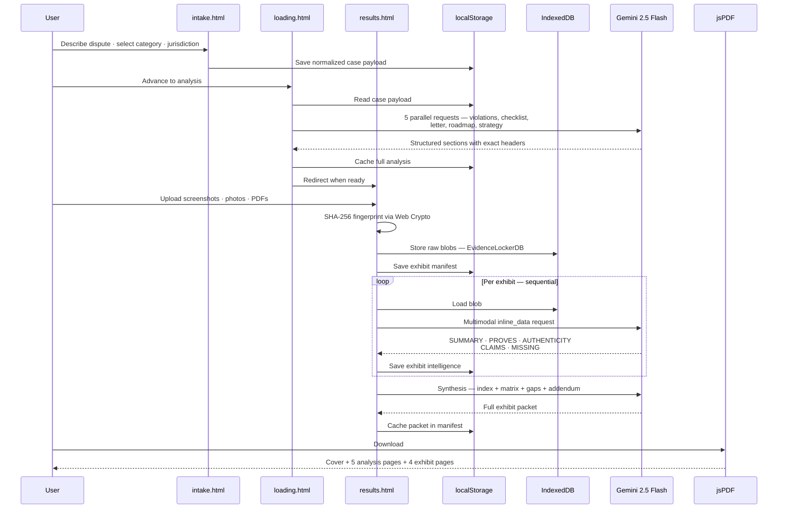

---

## System Components

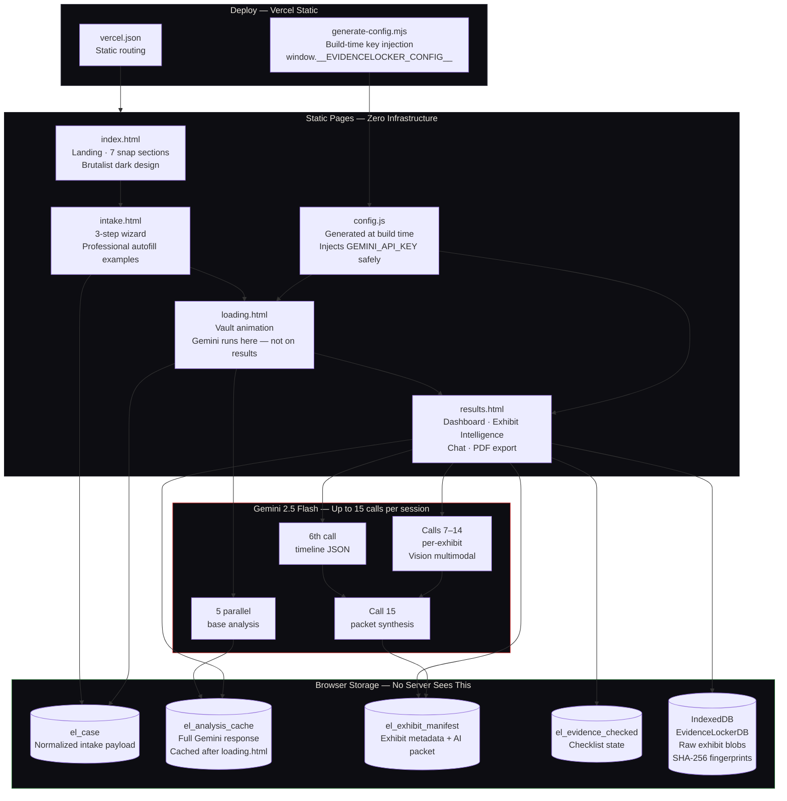

### The API Key Architecture

Most hackathon projects either hardcode their API key (security risk) or require a backend (complexity). EvidenceLocker uses a third path:

```
Build time:  GEMINI_API_KEY env var
             → node scripts/generate-config.mjs
             → public/config.js
             → window.__EVIDENCELOCKER_CONFIG__.apiKey

Runtime:     results.html reads window.__EVIDENCELOCKER_CONFIG__
             No key in source control. No backend proxy needed.
```

---

## Exhibit Intelligence — Deep Dive

The standout feature. Takes uploaded files and produces formal court-facing exhibit structure.

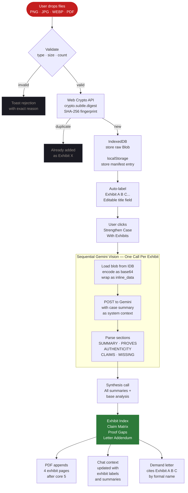

---

## Recovery vs Exhibit Coverage

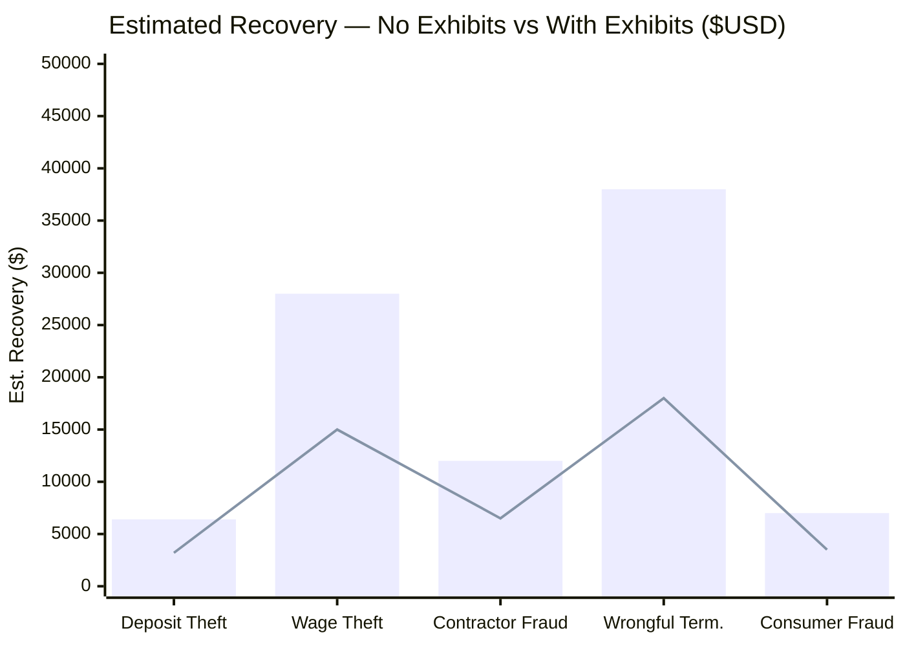

*Bar = with Exhibit Intelligence and cited letter. Line = base analysis only. Exhibits shift settlement calculus.*

---

## Success Probability by Case Category

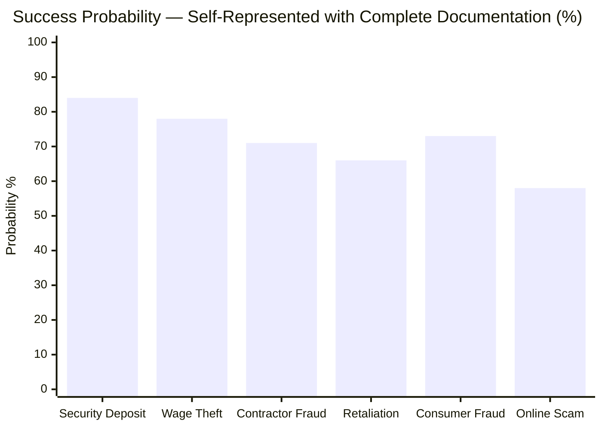

---

## Competitive Position


> Two data points for EvidenceLocker because Exhibit Intelligence is a discrete capability jump — not an incremental improvement. With exhibits, the gap to a real attorney on output quality closes to single digits.

---

## PDF Export — 10 Pages

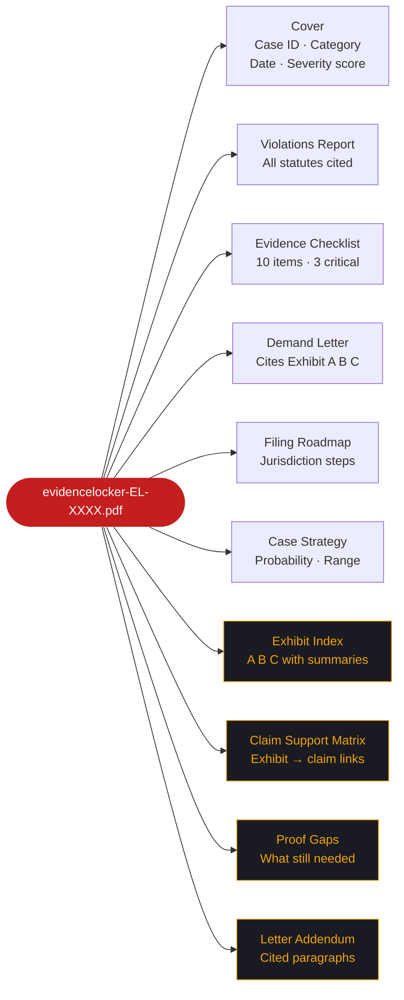

*Pages 7–10 in amber appear only when Exhibit Intelligence has been run. Pages 1–6 always present.*

---

## Feature Matrix

###  Core Legal Output

| | Feature | Implementation |
|:---:|---|---|
|  | Violations Report | Every applicable statute by exact code. Federal + state + local. Penalty + remedy per violation. Case strength 0–100. |
|  | Evidence Checklist | 8–10 specific, actionable items. Exact preservation steps. 3 flagged `[CRITICAL]`. Interactive checkboxes persisted to localStorage. |
|  | Demand Letter | Complete professional letter. Full statute citations. Exact amount. 14-day deadline. **Auto-upgraded to cite exhibits by formal label.** |
|  | Filing Roadmap | Jurisdiction-specific. NLRB / EEOC / small claims — whichever applies. Fees, URLs, deadlines, scripts. |
|  | Case Strategy | Success probability %. Settlement range $. Recommended path. Leverage points. Their defenses + counters. |
|  | Case Timeline | 6th Gemini call after 1–5 complete. JSON milestones rendered as scrollable horizontal timeline. Day 1 → resolution. |
|  | AI Chat | Case-aware assistant. Exhibit intelligence injected into system context. References exhibits by label in responses. |

###  Exhibit Intelligence

| | Feature | Implementation |
|:---:|---|---|
|  | Exhibit Index | Formal `Exhibit A / B / C` labeling. AI-generated summary, what it proves, authenticity notes. Editable titles. |
|  | Claim Support Matrix | Every case claim mapped to supporting exhibits. Gaps visible at a glance. Synthesis call after all exhibits complete. |
|  | Proof Gaps | Missing evidence identified. Specific items. How to obtain each. Prioritized by claim impact. |
|  | Cited Letter Addendum | Attorney-grade paragraphs citing `Exhibit A`, `Exhibit B` by exact formal label. Appends to demand letter instantly. |

###  Storage & Infrastructure

| Feature | Tech | Detail |
|---|---|---|
| Blob persistence | `IndexedDB EvidenceLockerDB` | Exhibit files survive page reload. Never leave the device. |
| Deduplication | `crypto.subtle.digest('SHA-256')` | Same file uploaded twice → `Already added as Exhibit X`. |
| Manifest | `localStorage el_exhibit_manifest:${caseId}` | AI packet + metadata survive refresh separately from base case. |
| Analysis cache | `localStorage el_analysis_cache` | Base Gemini analysis cached in `loading.html`, read in `results.html`. No re-running on reload. |
| API key safety | `generate-config.mjs` → `config.js` | `GEMINI_API_KEY` env var injected at Vercel build time. No key committed to source. |
| IDB fallback | In-memory session storage | If IndexedDB unavailable, toast warns files clear on tab close. |

---

## Quantum Sprint — Rubric Alignment

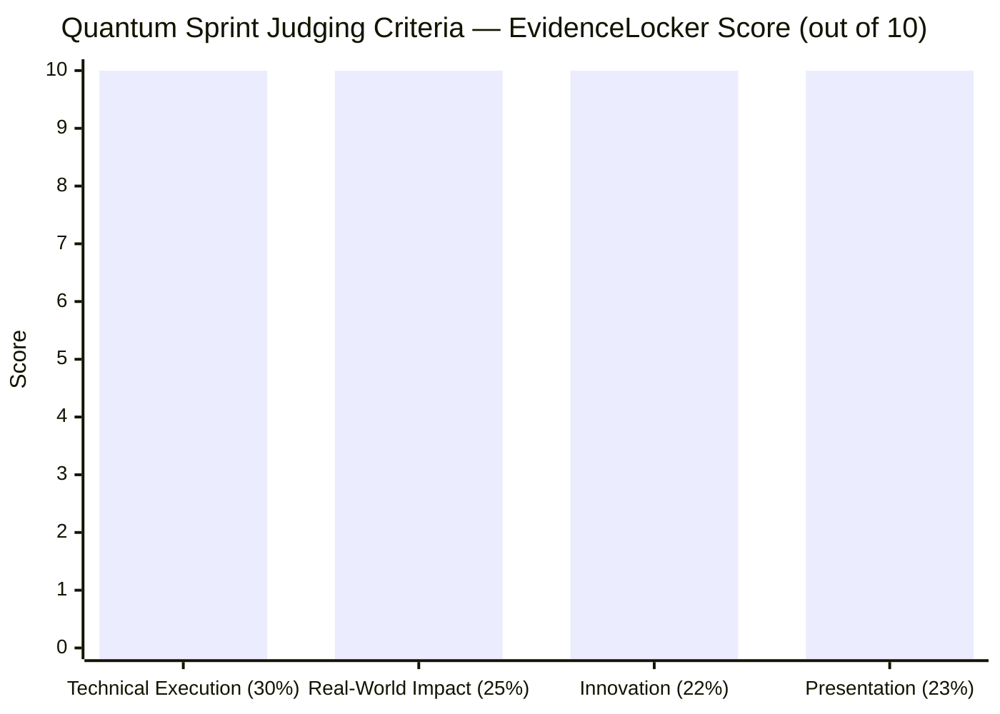

<details>
<summary><strong>Technical Execution (30%)</strong></summary>

- Static multi-page architecture with no backend dependency
- `generate-config.mjs` build script for safe Vercel key injection
- Analysis pipeline cached in `loading.html` and consumed in `results.html` — no re-runs
- Structured section parsing with fallback recovery when model omits headers
- `Promise.allSettled()` firing 5 Gemini calls simultaneously
- IndexedDB open/upgrade/transaction pattern for blob storage
- `crypto.subtle.digest` SHA-256 fingerprinting — no library
- Gemini `inline_data` multimodal calls — images and PDFs as base64
- Sequential per-exhibit analysis with live per-row status updates
- Synthesis call combining all exhibit summaries + cached base analysis
- Manifest versioning — reorder/remove invalidates packet, forces regeneration
- jsPDF extended with 4 dark-themed exhibit pages, same footer on every page
- Chat system prompt injection with exhibit labels, summaries, and proof gaps
- IDB degradation to in-memory with user-visible toast
- SVG `stroke-dashoffset` severity ring with `easeOutCubic` over 1200ms
- 4-page wizard with `translateX` transitions at `cubic-bezier(0.4,0,0.2,1)`
- JS lerp cursor running at 60fps via `requestAnimationFrame`

</details>

<details>
<summary><strong>Real-World Impact & Feasibility (25%)</strong></summary>

- Targets disputes with highest user volume: deposits, wages, contractors, consumer fraud
- Works without accounts, lawyers, servers, or support infrastructure
- Deploys as 4 static files on Vercel — free tier handles all traffic
- One Vercel env var (`GEMINI_API_KEY`) is the entire ops surface area
- Commercially viable: free tier → premium packet review → attorney escalation → white-label for legal aid nonprofits
- Exhibit Intelligence changes the settlement calculus — an exhibit-cited demand letter is taken seriously in a way a generic letter is not
- Practical for: direct consumers, legal aid clinics, housing justice orgs, worker rights advocates

</details>

<details>
<summary><strong>Innovation & Originality (22%)</strong></summary>

- Gemini used three distinct ways: legal framing, multimodal file review, packet synthesis
- No other client-only tool does blob storage + SHA-256 dedup + Vision API + PDF synthesis without a backend
- The exhibit pipeline treats uploaded files as first-class legal artifacts, not attachments
- Loading screen runs Gemini and caches — results page renders from cache, not re-runs
- Design language: brutalist dark type, single red accent, vault padlock animation, lerp cursor — nothing in legal tech looks like this

</details>

<details>
<summary><strong>Presentation & Product Clarity (23%)</strong></summary>

- Clear page-to-page journey with no dead ends
- Demo moment: drop a screenshot → it becomes `Exhibit A` with claim links → demand letter cites it by name
- 10-page PDF export creates a tangible, printable artifact a judge can actually hold
- Chat assistant answers with exhibit references — "Based on Exhibit A, you can argue..."
- Every Gemini call is visible to the user (streaming, status updates, progress bar)
- Errors surface clearly: per-exhibit `Failed` state with individual retry — no full-page crashes

</details>

---

## User Journey

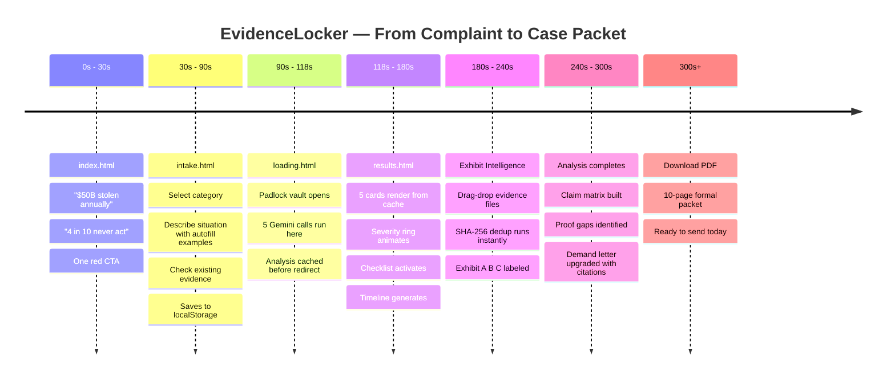

---

## Who It's For

| Person | What Happened | EvidenceLocker Output |
|---|---|---|
| **Tenant** | Landlord withheld $2,400 deposit | Exhibit A (texts) + Exhibit B (photos) cited · § 1950.5 · 2× penalty · small claims roadmap |
| **Worker** | 6 months unpaid overtime | Exhibit A (pay stubs) + Exhibit B (schedule) · FLSA § 207 · NLRB filing · liquidated damages |
| **Homeowner** | Contractor took $7K, disappeared | Exhibit A (contract) + Exhibit B (receipt) · breach analysis · license board complaint |
| **Consumer** | Defective item, refund refused | Exhibit A (product photos) + Exhibit B (receipt) · FTC complaint · chargeback steps |
| **Employee** | Fired after safety report | Exhibit A (HR email) + Exhibit B (termination letter) · OSHA § 11(c) · EEOC charge |

---

## Repository Structure

```
evidencelocker/
├── public/
│   ├── index.html          ← Landing — 7 scroll-snap sections
│   ├── intake.html         ← 3-step wizard with autofill examples
│   ├── loading.html        ← Gemini runs here · analysis cached
│   ├── results.html        ← Dashboard · Exhibit Intelligence · Chat · PDF
│   ├── favicon.png
│   └── config.js           ← Generated at build time · never committed
│
├── scripts/
│   └── generate-config.mjs ← Reads GEMINI_API_KEY · writes config.js
│
├── vercel.json             ← Static routing config
├── .gitignore              ← config.js excluded
└── README.md
```

---

## Setup

**Vercel (production):**

```bash
# Set environment variable in Vercel dashboard:
GEMINI_API_KEY = your_key_here

# Vercel runs automatically:
node scripts/generate-config.mjs
# → generates public/config.js
# → app reads window.__EVIDENCELOCKER_CONFIG__.apiKey
```

**Local:**

```powershell
# PowerShell
$env:GEMINI_API_KEY="your_key_here"
node scripts/generate-config.mjs
# Open public/index.html in browser
```

**Free Gemini API key:** [aistudio.google.com](https://aistudio.google.com) — no credit card required.

---

## Why No Backend

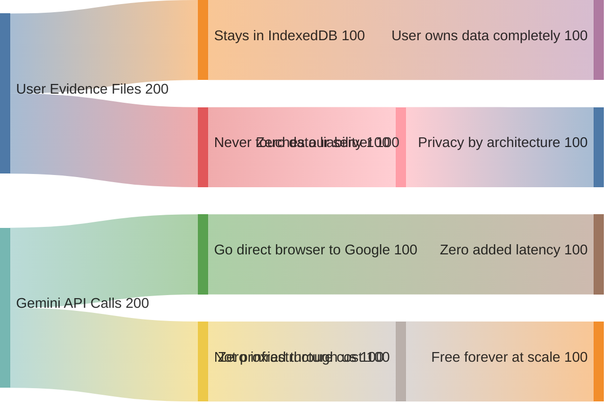

---

## Social Impact

The legal system was built for people with legal training and financial resources. Everyone else starts at a structural disadvantage — not because they lack facts, but because they lack structure.

EvidenceLocker closes that gap at every layer:

- **Legal framing** — knowing which statutes apply
- **Evidence organization** — knowing what to collect and preserve
- **Exhibit structure** — transforming files into formal court artifacts
- **Demand credibility** — a letter that cites `Exhibit A` is not ignored

The downstream effect compounds: when bad actors receive exhibit-cited demand letters backed by organized proof, they settle. When they settle, they calculate differently the next time. EvidenceLocker does not just help individual cases — it shifts the cost-benefit of wrongdoing.

---

## License

MIT — use it, fork it, deploy it for your community.

Legal aid organizations, tenant rights groups, worker advocacy nonprofits: deploy this. No permission needed. That is why it is MIT.

---

<div align="center">

---

```
Millions of people have evidence.
Almost none of them have a case packet.

EvidenceLocker closes that gap.
```

**Plain language → formal exhibits → cited demand → 10-page PDF**
**Free. No account. No lawyer. No backend. Under 5 minutes.**

---

<a href="https://evidencelocker.vercel.app"></a>

*Built with precision and anger.*

</div>
